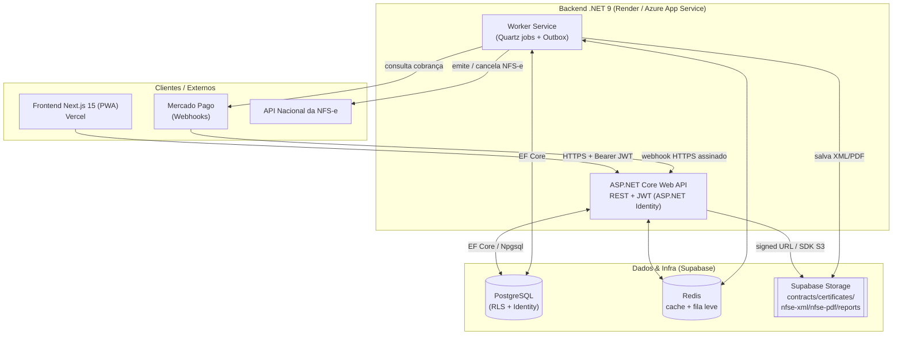
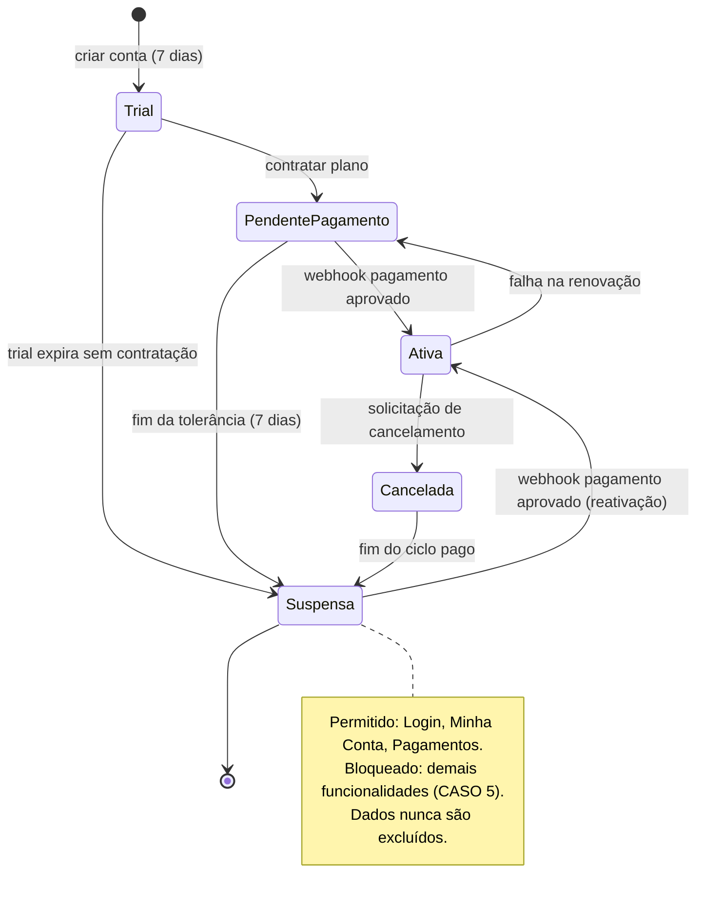
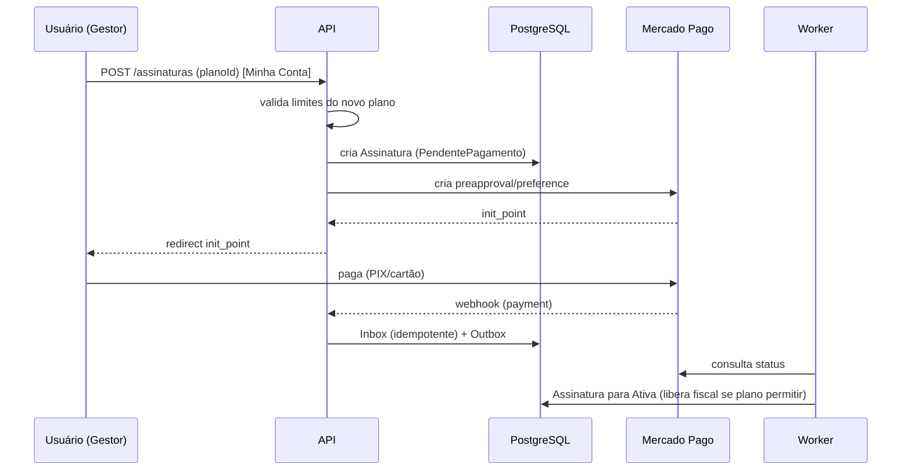
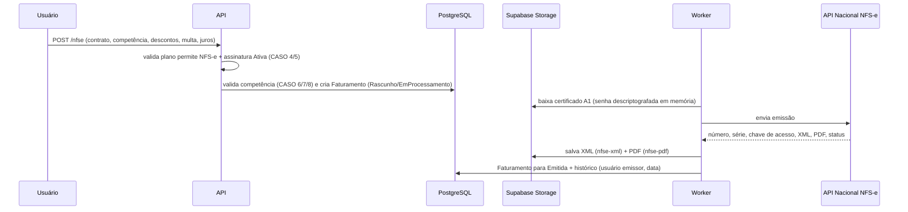
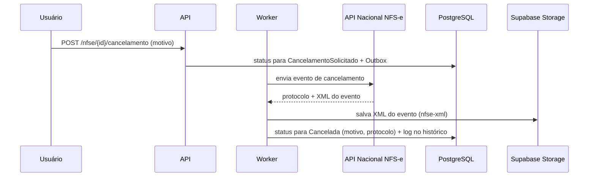

# 01 — Arquitetura da Solução

> Plataforma **APP Aluguel** — SaaS multi-tenant para gestão de locações, recebimentos, inadimplência e emissão de **NFS-e** (via **API Nacional da NFS-e**), operada pela **Lucrare Contabilidade Estratégia LTDA** (CNPJ 51.095.456/0001-13), hospedada em subdomínio de `lucrarecontabilidade.com.br`.

## 1. Stack oficial (definida na especificação, §19)

| Camada | Tecnologia |
|---|---|
| **Frontend** | **Next.js 15** · React 19 · TypeScript · Tailwind v4 · shadcn/ui · Lucide · **Recharts** · **next-pwa** |
| **Backend** | **.NET 9 Web API** · **EF Core** · **FluentValidation** · **JWT** · **ASP.NET Core Identity** · **QuestPDF** (PDF) · **ClosedXML** (XLSX) |
| **Banco** | **PostgreSQL** (Supabase) |
| **Storage** | **Supabase Storage** |
| **Pagamentos** | **Mercado Pago** (assinaturas + webhooks) |
| **NFS-e** | **API Nacional da NFS-e** (primeiro momento) |
| **Hospedagem** | **Vercel** (frontend) · **Render** ou **Azure App Service** (backend) · **Supabase** (DB + Storage) |

Complementos de backend adotados: **MediatR** (CQRS leve), **Mapster**, **Quartz.NET** (jobs), **Polly** (resiliência), **Serilog + OpenTelemetry** (observabilidade).

## 2. Objetivos arquiteturais

| Objetivo | Como é atendido |
|---|---|
| **Multi-tenant com segregação total** (RNF §14) | `tenant_id` em todas as tabelas + *EF Core global query filters* + **RLS** do PostgreSQL. Um usuário nunca vê dados de outro cliente. Ver [06](06-Estrategia-Multi-Tenant.md). |
| **Segurança fiscal** (certificado A1) | Arquivo PFX no bucket `certificates`; **senha criptografada** no backend, nunca exposta ao frontend. Ver [07](07-Estrategia-Supabase-Storage.md). |
| **Cobrança recorrente confiável** | Mercado Pago + webhooks idempotentes (Inbox) + *state machine* de assinatura + jobs de tolerância/suspensão/reativação. |
| **Trilha de auditoria completa** | `audit_log` genérico (login, emissão, cancelamento, pagamento, despesas, alteração cadastral) + `auditoria_assinatura`. |
| **Emissão/cancelamento de NFS-e** | Módulo fiscal integrando a **API Nacional da NFS-e**; XML/PDF/chave de acesso persistidos e disponíveis para download. |
| **Performance** (RNF: < 2s, paginação) | Consultas paginadas, índices, cache Redis, projeções (sem *over-fetch*). |
| **LGPD + Backup** | *Soft delete* (dados não excluídos no cancelamento), backup diário e retenção mínima de 90 dias. |

## 3. Estilo arquitetural

**Clean Architecture / Onion** com **DDD tático** (agregados, domain events, value objects) e **CQRS leve** via MediatR.

## 4. Camadas (Clean Architecture)

```mermaid
flowchart LR
    subgraph Domain["Domain (núcleo)"]
      D1["Agregados: Cliente, Assinatura,<br/>Imovel, Contrato, Faturamento(NFS-e),<br/>Pagamento, Despesa..."]
      D2["Value Objects: Cpf, Cnpj,<br/>Dinheiro, Endereco, Competencia"]
      D3["Domain Events + contratos<br/>de repositório"]
    end
    subgraph Application["Application"]
      A1["Commands / Queries (MediatR)"]
      A2["Validators (FluentValidation)"]
      A3["Ports: Storage, Fiscal (NFS-e),<br/>Pagamento, PDF, Planilha, E-mail"]
    end
    subgraph Infrastructure["Infrastructure"]
      I1["EF Core + Identity + Migrations"]
      I2["Interceptors (tenant, auditoria,<br/>soft delete, outbox)"]
      I3["Adapters: MercadoPago, API Nacional NFS-e,<br/>Supabase Storage, QuestPDF, ClosedXML"]
    end
    subgraph Presentation["Presentation"]
      P1["Web API (Controllers)"]
      P2["Worker (Quartz + Outbox)"]
    end

    Presentation --> Application --> Domain
    Infrastructure --> Application
    Infrastructure --> Domain
    Presentation --> Infrastructure
```

Regra de dependência: **tudo aponta para o `Domain`**; `Domain` não referencia nada externo.

## 5. Componentes de aplicação

| Componente | Responsabilidade |
|---|---|
| **API (`Aluguel.Api`)** | Endpoints REST, autenticação/autorização (Identity + JWT, perfis Gestor/Analista/AdminSistema), validação de plano/limites, guarda de assinatura suspensa, recepção de webhooks Mercado Pago. |
| **Worker (`Aluguel.Worker`)** | Jobs: trial expirado, tolerância, suspensão, reativação, geração de cobrança, fila de emissão/cancelamento de NFS-e, reprocessamento de webhooks. |
| **Módulo Fiscal** | Emissão/cancelamento via API Nacional da NFS-e; controle de competência; persistência de XML/PDF/chave. |
| **Módulo Billing** | *State machine* de `Assinatura`; Mercado Pago; upgrade/downgrade com validação de limites. |
| **Módulo Financeiro** | Faturamento, registro de pagamentos de aluguel, IPTU e outras despesas. |
| **Módulo Relatórios** | Exportação XLSX/CSV (ClosedXML) e PDF (QuestPDF): Contas a Receber, Contas a Pagar, faturamentos. |
| **Módulo Storage** | Abstração sobre Supabase Storage (upload, signed URL). |

## 6. Máquina de estados da Assinatura

Cada transição gera `auditoria_assinatura` (Cliente, Usuário, Data/Hora, IP, Plano anterior, Novo plano, Valor, Descrição).

## 7. Fluxos-chave

### 7.1 Contratação de plano (Mercado Pago)

### 7.2 Emissão de NFS-e (API Nacional)

### 7.3 Cancelamento de NFS-e

## 8. Requisitos não funcionais (§14)

- **Segurança**: HTTPS obrigatório; senhas com hash (ASP.NET Identity); **MFA opcional**; segregação total entre tenants (RLS); LGPD.
- **Performance**: telas < 2s (índices, cache, paginação obrigatória em listas).
- **Backup**: diário, retenção mínima de 90 dias (PITR do Supabase + export de documentos fiscais).
- **Idempotência**: webhooks via `inbox_message` com chave única.

## 9. Ambientes

| Ambiente | Descrição |
|---|---|
| **Local** | Docker Compose (PostgreSQL + Redis) + Supabase local opcional; Mercado Pago e NFS-e em *sandbox*/homologação. |
| **Staging** | Backend em Render/Azure, Supabase dedicado, integrações em homologação. |
| **Produção** | Subdomínio da Lucrare (frontend na Vercel), Supabase produção, NFS-e e Mercado Pago em produção. |

Próximo: [02 — Estrutura dos Projetos](02-Estrutura-dos-Projetos.md).
