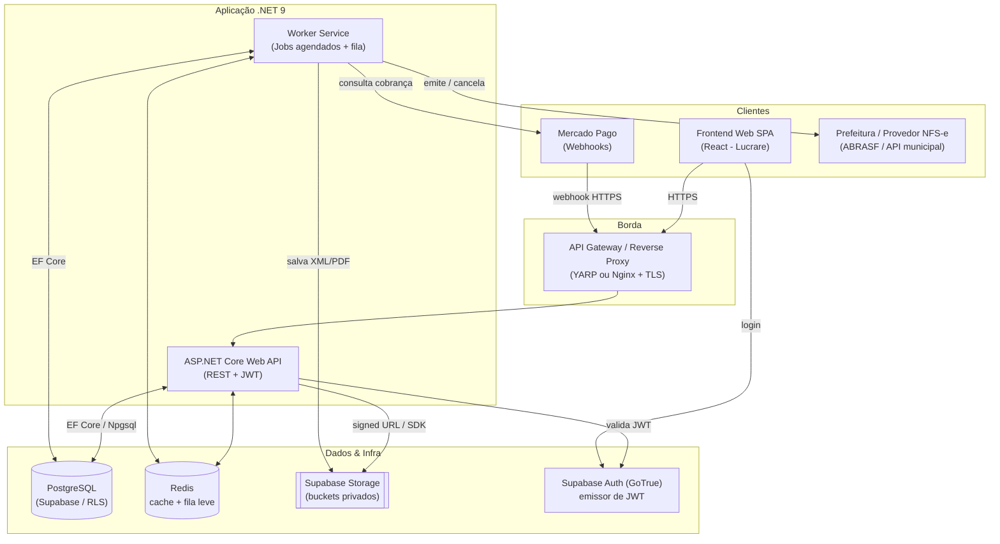
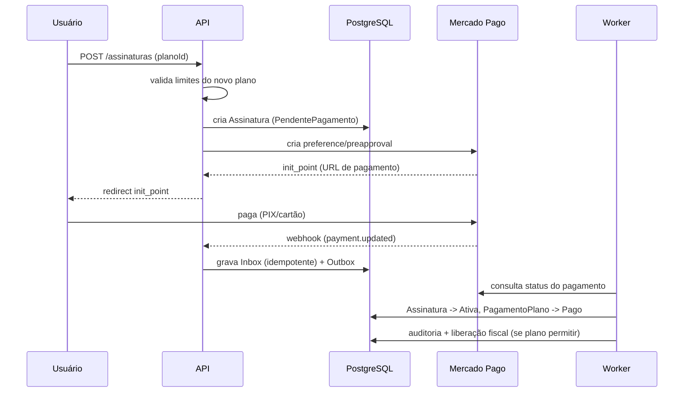
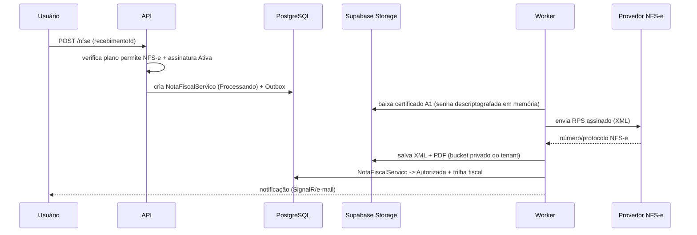

# 01 — Arquitetura da Solução

> Plataforma **APP Aluguel** — SaaS multi-tenant para gestão de locações, recebimentos, inadimplência e emissão de **NFS-e**, operada pela **Lucrare Contabilidade Estratégia LTDA** (CNPJ 51.095.456/0001-13).

## 1. Objetivos arquiteturais

| Objetivo | Como é atendido |
|---|---|
| **Multi-tenant** com isolamento lógico forte | Banco único PostgreSQL com coluna `tenant_id` + *EF Core global query filters* + **RLS** (Row Level Security) do PostgreSQL como segunda barreira. Ver [06 — Multi-tenant](06-Estrategia-Multi-Tenant.md). |
| **Segurança fiscal** (certificado A1, XML/PDF de NFS-e) | Segredos e senha do certificado criptografados no backend; arquivos em **Supabase Storage** com buckets privados e *signed URLs*. Ver [07](07-Estrategia-Supabase-Storage.md). |
| **Cobrança recorrente confiável** (Mercado Pago) | Webhooks idempotentes + *Outbox/Inbox pattern* + *state machine* de assinatura + jobs agendados de tolerância/suspensão. |
| **Auditoria completa** | Tabela `auditoria_assinatura` + `audit_log` genérico gravados de forma assíncrona (interceptor EF + domain events). |
| **Resiliência de integrações externas** | Polly (retry/circuit breaker), fila de reprocessamento, workers desacoplados. |
| **Escalabilidade horizontal** | API *stateless* (JWT), jobs em processo worker separado, banco gerenciado (Supabase). |
| **Observabilidade** | Serilog estruturado + OpenTelemetry (traces/metrics) + health checks. |

## 2. Estilo arquitetural

Adotamos **Clean Architecture / Onion** com pitadas de **DDD tático** (agregados, domain events, value objects) e **CQRS leve** via *MediatR* (separação de *Commands* e *Queries*, sem event sourcing).

## 3. Camadas (Clean Architecture)

```mermaid
flowchart LR
    subgraph Domain["Domain (núcleo)"]
      D1["Entidades / Agregados<br/>Cliente, Assinatura, Imovel,<br/>Inquilino, Recebimento, NfSe..."]
      D2["Value Objects<br/>Cpf, Cnpj, Dinheiro, Endereco"]
      D3["Domain Events + Interfaces<br/>de repositório"]
    end
    subgraph Application["Application (casos de uso)"]
      A1["Commands / Queries (MediatR)"]
      A2["Validators (FluentValidation)"]
      A3["DTOs, Ports (interfaces de<br/>Storage, Fiscal, Pagamento)"]
    end
    subgraph Infrastructure["Infrastructure"]
      I1["EF Core DbContext + Migrations"]
      I2["Repositórios, Interceptors<br/>(auditoria, tenant, outbox)"]
      I3["Adapters: MercadoPago, NFS-e,<br/>Supabase Storage, E-mail"]
    end
    subgraph Presentation["Presentation"]
      P1["Web API (Controllers/Minimal)"]
      P2["Worker (HostedServices/Jobs)"]
    end

    Presentation --> Application --> Domain
    Infrastructure --> Application
    Infrastructure --> Domain
    Presentation --> Infrastructure
```

Regra de dependência: **tudo aponta para o `Domain`**; `Domain` não referencia nada externo. `Application` define *ports* (interfaces) e `Infrastructure` implementa os *adapters*.

## 4. Componentes de aplicação

| Componente | Responsabilidade |
|---|---|
| **API (`Aluguel.Api`)** | Endpoints REST, autenticação/autorização, validação de plano (limites de imóveis/usuários), recepção de webhooks Mercado Pago (assíncrono via Outbox). |
| **Worker (`Aluguel.Worker`)** | Jobs recorrentes: verificação de trial expirado, período de tolerância, suspensão por inadimplência, geração de cobranças, processamento de fila de emissão de NFS-e, reprocessamento de webhooks. |
| **Módulo Fiscal** | Orquestra emissão/cancelamento de NFS-e usando o certificado A1 do tenant; persiste XML/PDF e trilha fiscal. |
| **Módulo Billing** | *State machine* de `Assinatura`, integração Mercado Pago (assinaturas/pagamentos), upgrade/downgrade com validação de limites. |
| **Módulo Storage** | Abstração sobre Supabase Storage (upload, signed URL, versionamento de documentos). |

## 5. Máquina de estados da Assinatura

Regras extraídas da especificação (Trial 7 dias → tolerância 7 dias → suspensão; reativação automática via webhook; cancelamento mantém acesso até o fim do ciclo).

Cada transição gera um registro em `auditoria_assinatura` (Cliente, Usuário, Data/Hora, IP, Plano anterior, Novo plano, Valor, Descrição).

## 6. Fluxos-chave

### 6.1 Contratação de plano (com Mercado Pago)

### 6.2 Emissão de NFS-e

## 7. Stack tecnológico

| Camada | Tecnologia |
|---|---|
| Runtime | **.NET 9 / C# 13** |
| API | ASP.NET Core Web API (Controllers) + **MediatR** + **FluentValidation** + **Mapster** |
| ORM | **EF Core 9** + **Npgsql** |
| Banco | **PostgreSQL 16** (Supabase gerenciado) |
| Storage | **Supabase Storage** (S3-compatível) |
| Auth | **Supabase Auth (GoTrue)** emitindo JWT, validado pela API (ver [08](08-Estrategia-Autenticacao.md)) |
| Jobs | **Quartz.NET** (agendados) + Outbox para eventos |
| Cache/fila leve | **Redis** (StackExchange.Redis) |
| Resiliência | **Polly** |
| Observabilidade | **Serilog** + **OpenTelemetry** + HealthChecks |
| Fiscal | Biblioteca ABRASF/NFS-e (ex.: integração com provedor municipal) + assinatura XML (`System.Security.Cryptography.Xml`) |
| Pagamento | SDK/HTTP **Mercado Pago** (Assinaturas/Preapproval + Payments) |
| Testes | xUnit + FluentAssertions + Testcontainers (PostgreSQL) |
| CI/CD | GitHub Actions + EF Core migrations bundle |
| Container | Docker (multi-stage) |

## 8. Ambientes

| Ambiente | Descrição |
|---|---|
| **Local** | Docker Compose (PostgreSQL + Redis + Supabase local opcional). |
| **Staging** | Supabase (projeto dedicado) + deploy container. Mercado Pago em *sandbox*, NFS-e em homologação. |
| **Produção** | Subdomínio da Lucrare, Supabase produção, certificados reais, NFS-e em produção. |

## 9. Requisitos não-funcionais

- **Segurança**: TLS obrigatório; senha de certificado nunca trafega ao frontend; segredos em *secret manager*/variáveis de ambiente; RLS no banco.
- **LGPD**: dados de clientes/inquilinos com base legal; *soft delete* (dados não são apagados no cancelamento) e trilha de auditoria.
- **Idempotência**: todo webhook processado via `Inbox` com chave única do provedor.
- **Disponibilidade**: API stateless permite múltiplas réplicas atrás do gateway.
- **Backups**: PITR do Supabase + export periódico de documentos fiscais.

Próximo: [02 — Estrutura dos Projetos](02-Estrutura-dos-Projetos.md).
