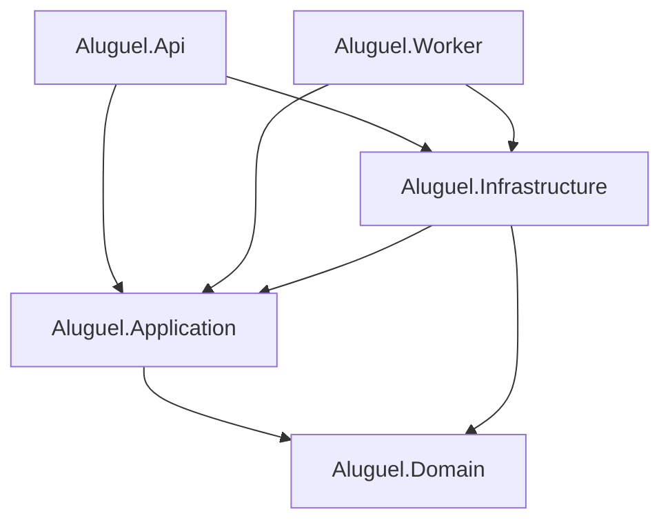

# 02 — Estrutura dos Projetos

O produto tem **dois repositórios/artefatos**: o **frontend Next.js 15** (deploy na Vercel) e o **backend .NET 9** (deploy em Render/Azure). Este documento detalha o backend em **Clean Architecture** e resume o frontend.

## 1. Backend — solução .NET

```text
app-aluguel-api/
├── Aluguel.sln
├── Directory.Build.props            # nullable, langversion, analyzers
├── Directory.Packages.props         # Central Package Management
├── docker-compose.yml               # Postgres + Redis
├── src/
│   ├── Aluguel.Domain/              # Núcleo: entidades, VOs, eventos, contratos
│   ├── Aluguel.Application/         # Casos de uso (CQRS/MediatR), ports, validators
│   ├── Aluguel.Infrastructure/      # EF Core + Identity, repositórios, adapters
│   ├── Aluguel.Api/                 # ASP.NET Core Web API
│   └── Aluguel.Worker/              # Worker Service (Quartz + Outbox)
└── tests/
    ├── Aluguel.Domain.UnitTests/
    ├── Aluguel.Application.UnitTests/
    ├── Aluguel.Infrastructure.IntegrationTests/   # Testcontainers (Postgres)
    └── Aluguel.Api.FunctionalTests/               # WebApplicationFactory + BDD (§18)
```

### Dependências entre projetos



## 2. `Aluguel.Domain`

```text
Aluguel.Domain/
├── Common/            Entity, AggregateRoot, ITenantOwned, ISoftDeletable, IAuditable, ValueObject
├── Tenancy/           Tenant
├── Clientes/          Cliente (PF/PJ), TipoPessoa, StatusCliente
├── Usuarios/          Usuario, PerfilUsuario (Gestor/Analista/AdminSistema), StatusUsuario (Ativo/Inativo/Bloqueado)
├── Assinaturas/       Assinatura, PagamentoPlano, Plano, StatusAssinatura, AuditoriaAssinatura, Events/
├── Imoveis/           Imovel, TipoImovel (Residencial/Comercial/Galpao/Sala/Outro), StatusImovel (Ativo/Inativo)
├── Inquilinos/        Inquilino
├── Contratos/         Contrato, StatusContrato (Ativo/Encerrado/Cancelado)
├── Fiscal/            Faturamento (NFS-e), StatusNfse (Rascunho/EmProcessamento/Emitida/Rejeitada/
│                      CancelamentoSolicitado/Cancelada), CertificadoDigital, DocumentoFiscal
├── Financeiro/        Pagamento (aluguel), Despesa (IPTU/Outras), TipoDespesa
├── Auditoria/         AuditLog
├── ValueObjects/      Cpf, Cnpj, Dinheiro, Email, Endereco, Competencia
└── Abstractions/      IRepository, IUnitOfWork, Repositories/
```

## 3. `Aluguel.Application`

```text
Aluguel.Application/
├── Common/
│   ├── Behaviors/     ValidationBehavior, LoggingBehavior, TransactionBehavior, AuditBehavior
│   ├── Mappings/      perfis Mapster
│   └── Exceptions/    NotFound, PlanoLimiteExcedido, CompetenciaJaFaturada, ContratoAtivoExistente...
├── Abstractions/      (PORTS)
│   ├── ICurrentTenant / ICurrentUser
│   ├── IFileStorage           (Supabase Storage)
│   ├── IPagamentoGateway      (Mercado Pago)
│   ├── INfseNacionalProvider  (API Nacional da NFS-e)
│   ├── ISecretProtector       (senha do certificado)
│   ├── IPdfGenerator          (QuestPDF)
│   ├── IPlanilhaExporter       (ClosedXML - XLSX/CSV)
│   ├── IEmailSender / IDateTimeProvider
├── Clientes/ · Usuarios/ · Imoveis/ · Inquilinos/ · Contratos/
├── Assinaturas/   (ContratarPlano, Upgrade, Downgrade, Cancelar, ProcessarWebhook)
├── Fiscal/        (EmitirNfse, CancelarNfse, ConsultarHistorico, UploadCertificado)
├── Financeiro/    (RegistrarPagamento, RegistrarIptu, RegistrarDespesa)
├── Relatorios/    (ContasAReceber, ContasAPagar, ExportarXlsxCsv)
├── Home/          (Indicadores + filtros da tela inicial)
└── DependencyInjection.cs
```

## 4. `Aluguel.Infrastructure`

```text
Aluguel.Infrastructure/
├── Persistence/
│   ├── AppDbContext.cs           (herda IdentityDbContext<AppUser, AppRole, Guid>)
│   ├── Configurations/           IEntityTypeConfiguration<T>
│   ├── Interceptors/             Tenant, Auditable, SoftDelete, Outbox, RlsConnection
│   ├── Repositories/ · Migrations/ · Outbox/ · Inbox/
├── Identity/                     AppUser, AppRole, JwtTokenService, políticas de perfil
├── Tenancy/                      TenantResolver (claim tenant_id/cliente_id)
├── Integrations/
│   ├── MercadoPago/              IPagamentoGateway
│   ├── NfseNacional/             INfseNacionalProvider (API Nacional)
│   ├── Storage/SupabaseStorage/  IFileStorage
│   └── Email/
├── Reporting/
│   ├── QuestPdf/                 IPdfGenerator
│   └── ClosedXml/                IPlanilhaExporter
├── Security/                     DataProtectionSecretProtector (senha do certificado)
└── DependencyInjection.cs
```

## 5. `Aluguel.Api`

```text
Aluguel.Api/
├── Program.cs
├── Controllers/          Clientes, Usuarios, Imoveis, Inquilinos, Contratos,
│                         Assinaturas, Nfse, Pagamentos, Despesas, Relatorios, Home
├── Webhooks/             MercadoPagoWebhookController (idempotente + HMAC)
├── Middleware/           TenantMiddleware, ExceptionHandling (ProblemDetails),
│                         AssinaturaSuspensaGuard (CASO 5)
├── Auth/                 JWT bearer, policies (perfis + plano)
├── appsettings.json
└── Extensions/           Swagger, CORS (origem Vercel), versionamento, rate limiting
```

## 6. `Aluguel.Worker`

```text
Aluguel.Worker/
├── Jobs/                 TrialExpiradoJob, ToleranciaInadimplenciaJob, GerarCobrancaRenovacaoJob,
│                         ReprocessarWebhookJob, ProcessarFilaNfseJob (emissão/cancelamento)
├── Outbox/OutboxProcessor.cs
└── Scheduling/QuartzConfig.cs
```

## 7. Frontend — Next.js 15 (`web/`)

Aplicação no monorepo (`web/`, deploy na Vercel), App Router, identidade **Lucrare** (skill `.cursor/skills/lucrare-frontend`). Consome a API .NET via BFF (Route Handlers + cookies httpOnly) e `Authorization: Bearer` no servidor.

```text
web/
├── app/
│   ├── login/                     # autenticação (card centralizado)
│   ├── api/auth/                  # BFF: login, logout, refresh
│   └── (dashboard)/               # layout: menu lateral + header navy
│       ├── page.tsx               # Home: indicadores + lista (clientes p/ Admin, imóveis p/ demais)
│       ├── clientes/              # Administrador
│       ├── imoveis|inquilinos|contratos
│       ├── usuarios/              # Administrador / Gestor
│       ├── minha-conta/           # Gestor
│       ├── relatorios/            # Gestor / Analista
│       ├── contabilidade/         # Gestor
│       └── auditoria/             # Administrador / Gestor
├── components/
│   ├── ui/                        # shadcn/ui
│   ├── layout/                    # sidebar, header, tema
│   ├── data/                      # tabela desktop → cards mobile
│   └── home/                      # listas da home por perfil (clientes/imóveis)
├── lib/
│   ├── api/                       # client REST (fetch + JWT)
│   ├── auth/                      # cookies, JWT payload, sessão
│   └── navigation.ts              # menu §13 por perfil
├── app/globals.css                # tokens Lucrare + tema claro/escuro
└── middleware.ts                  # guarda de sessão + refresh
```

Tema claro/escuro (`next-themes`, classe `.dark`) e CORS da API para `http://localhost:3000` (produção: origem Vercel). PWA (`next-pwa`) permanece no Sprint 8.

Segue o design system **Lucrare** e Tailwind v4 + shadcn/ui.

## 8. Pacotes NuGet principais

```text
Microsoft.EntityFrameworkCore                       9.*
Npgsql.EntityFrameworkCore.PostgreSQL               9.*
Microsoft.AspNetCore.Identity.EntityFrameworkCore   9.*
Microsoft.AspNetCore.Authentication.JwtBearer       9.*
EFCore.NamingConventions                            9.*    (snake_case)
MediatR                                             12.*
FluentValidation                                    11.*
Mapster                                              7.*
Quartz / Quartz.Extensions.Hosting                   3.*
Polly                                                8.*
QuestPDF                                            2025.*  (PDF)
ClosedXML                                            0.104.* (XLSX)
Serilog.AspNetCore + OpenTelemetry                   *
```

## 9. Convenções

- **Central Package Management**; **Nullable** + *warnings as errors*.
- Linguagem ubíqua em **português**; técnico em inglês.
- Migrations versionadas e aplicadas via *bundle* no deploy.
- Cada Command/Query com validator e testes; cenários **BDD (§18)** cobertos em `FunctionalTests`.

Próximo: [03 — Modelo PostgreSQL](03-Modelo-PostgreSQL.md).
