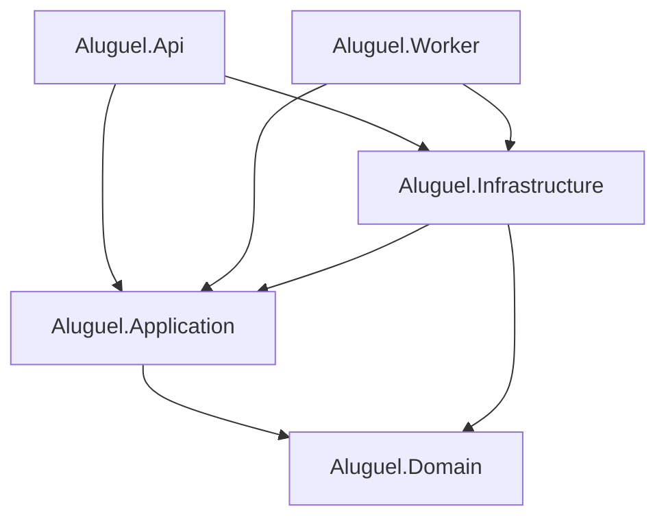

# 02 — Estrutura dos Projetos

Solução .NET 9 organizada em **Clean Architecture**. Um único `Aluguel.sln` com projetos por camada, mais testes.

## 1. Visão geral da solução

```text
app-aluguel/
├── Aluguel.sln
├── Directory.Build.props            # versões, nullable, langversion, analyzers
├── Directory.Packages.props         # Central Package Management (versões centralizadas)
├── docker-compose.yml               # Postgres + Redis + (Supabase local opcional)
├── .editorconfig
│
├── src/
│   ├── Aluguel.Domain/              # Núcleo: entidades, VOs, eventos, contratos
│   ├── Aluguel.Application/         # Casos de uso (CQRS/MediatR), ports, validators
│   ├── Aluguel.Infrastructure/      # EF Core, repositórios, adapters externos
│   ├── Aluguel.Api/                 # ASP.NET Core Web API (host HTTP)
│   └── Aluguel.Worker/              # Worker Service (jobs Quartz + processador Outbox)
│
├── tests/
│   ├── Aluguel.Domain.UnitTests/
│   ├── Aluguel.Application.UnitTests/
│   ├── Aluguel.Infrastructure.IntegrationTests/   # Testcontainers (Postgres)
│   └── Aluguel.Api.FunctionalTests/               # WebApplicationFactory
│
└── build/
    └── migrations-bundle.sh         # gera bundle de migrations para CI/CD
```

## 2. Dependências entre projetos



> `Domain` **não** referencia nenhum outro projeto. `Application` referencia apenas `Domain`. `Infrastructure` referencia `Application` + `Domain`. Os hosts (`Api`, `Worker`) referenciam `Application` + `Infrastructure` (a última apenas para *wire-up* de DI na composição raiz).

## 3. `Aluguel.Domain`

Sem dependências de framework (nem EF, nem ASP.NET). Regras de negócio puras.

```text
Aluguel.Domain/
├── Common/
│   ├── Entity.cs                 # base com Id (Guid), domain events
│   ├── AggregateRoot.cs
│   ├── ITenantOwned.cs           # marca entidades com TenantId
│   ├── ISoftDeletable.cs
│   ├── IAuditable.cs             # CreatedAt/UpdatedAt/CreatedBy...
│   └── ValueObject.cs
├── Tenancy/
│   └── Tenant.cs
├── Clientes/
│   ├── Cliente.cs                # agregado (PF/PJ)
│   ├── TipoPessoa.cs (enum)
│   └── StatusCliente.cs (enum)
├── Usuarios/
│   ├── Usuario.cs
│   └── PerfilUsuario.cs (enum: Admin, Operador, ...)
├── Assinaturas/
│   ├── Assinatura.cs             # agregado + máquina de estados
│   ├── PagamentoPlano.cs
│   ├── Plano.cs                  # catálogo (Trial, Básico...)
│   ├── StatusAssinatura.cs (enum)
│   ├── AuditoriaAssinatura.cs
│   └── Events/                   # AssinaturaAtivadaEvent, SuspensaEvent...
├── Imoveis/
│   ├── Imovel.cs
│   ├── TipoImovel.cs (enum)
│   └── StatusImovel.cs (enum)
├── Inquilinos/
│   └── Inquilino.cs
├── Locacoes/
│   ├── Contrato.cs               # vínculo imóvel <-> inquilino
│   └── Recebimento.cs            # parcela mensal de aluguel
├── Fiscal/
│   ├── NotaFiscalServico.cs      # NFS-e
│   ├── StatusNfse.cs (enum)
│   ├── CertificadoDigital.cs
│   └── DocumentoFiscal.cs        # metadados de arquivos no Storage
├── Auditoria/
│   └── AuditLog.cs
├── ValueObjects/
│   ├── Cpf.cs
│   ├── Cnpj.cs
│   ├── Dinheiro.cs               # (valor + moeda BRL)
│   ├── Email.cs
│   └── Endereco.cs
└── Abstractions/
    ├── IRepository.cs
    ├── IUnitOfWork.cs
    └── Repositories/             # IClienteRepository, IAssinaturaRepository...
```

## 4. `Aluguel.Application`

Casos de uso via **MediatR** (Command/Query handlers). Define *ports* implementadas na Infra.

```text
Aluguel.Application/
├── Common/
│   ├── Behaviors/                # ValidationBehavior, LoggingBehavior, TransactionBehavior
│   ├── Mappings/                 # perfis Mapster
│   └── Exceptions/               # NotFound, PlanoLimiteExcedido, ...
├── Abstractions/                 # PORTS (interfaces)
│   ├── ICurrentTenant.cs         # resolve TenantId da requisição
│   ├── ICurrentUser.cs
│   ├── IFileStorage.cs           # Supabase Storage
│   ├── IPagamentoGateway.cs      # Mercado Pago
│   ├── INfseProvider.cs          # provedor NFS-e
│   ├── ISecretProtector.cs       # cripto de senha de certificado
│   ├── IEmailSender.cs
│   └── IDateTimeProvider.cs
├── Clientes/
│   ├── Commands/ (Criar, Atualizar, ...)
│   └── Queries/  (ObterPorId, Listar, ...)
├── Usuarios/
├── Assinaturas/
│   ├── Commands/ (ContratarPlano, Upgrade, Downgrade, Cancelar, ProcessarWebhook)
│   └── Queries/
├── Imoveis/ · Inquilinos/ · Locacoes/
├── Fiscal/
│   ├── Commands/ (EmitirNfse, CancelarNfse, UploadCertificado)
│   └── Queries/
└── DependencyInjection.cs        # AddApplication()
```

## 5. `Aluguel.Infrastructure`

Implementa persistência e integrações.

```text
Aluguel.Infrastructure/
├── Persistence/
│   ├── AppDbContext.cs
│   ├── Configurations/           # IEntityTypeConfiguration<T> por entidade
│   ├── Interceptors/
│   │   ├── TenantSaveInterceptor.cs      # injeta TenantId ao inserir
│   │   ├── AuditableInterceptor.cs       # CreatedAt/UpdatedAt
│   │   ├── SoftDeleteInterceptor.cs
│   │   └── OutboxInterceptor.cs          # captura domain events -> Outbox
│   ├── Repositories/
│   ├── Migrations/
│   └── Outbox/ Inbox/
├── Tenancy/
│   ├── TenantResolver.cs         # lê claim tenant_id do JWT
│   └── RlsConnectionInterceptor.cs  # SET app.tenant_id na conexão (RLS)
├── Integrations/
│   ├── MercadoPago/              # IPagamentoGateway
│   ├── Nfse/                     # INfseProvider (ABRASF)
│   ├── Storage/SupabaseStorage/  # IFileStorage
│   └── Email/
├── Security/
│   └── DataProtectionSecretProtector.cs  # ISecretProtector (AES/DataProtection)
└── DependencyInjection.cs        # AddInfrastructure(config)
```

## 6. `Aluguel.Api`

```text
Aluguel.Api/
├── Program.cs                    # composição raiz (DI, middlewares, pipeline)
├── Controllers/                  # ClientesController, AssinaturasController, NfseController...
├── Webhooks/                     # MercadoPagoWebhookController (idempotente)
├── Middleware/
│   ├── TenantMiddleware.cs
│   ├── ExceptionHandlingMiddleware.cs   # ProblemDetails
│   └── PlanoGuardMiddleware.cs          # bloqueia funções quando Suspensa
├── Auth/                         # JWT bearer, policies (roles + plano)
├── appsettings.json
└── Extensions/                   # Swagger, CORS, versionamento
```

## 7. `Aluguel.Worker`

```text
Aluguel.Worker/
├── Program.cs
├── Jobs/
│   ├── TrialExpiradoJob.cs             # trial -> suspensa/liberação manual
│   ├── ToleranciaInadimplenciaJob.cs   # fim da tolerância -> suspensa
│   ├── GerarCobrancaRenovacaoJob.cs
│   ├── ReprocessarWebhookJob.cs
│   └── ProcessarFilaNfseJob.cs
├── Outbox/OutboxProcessor.cs           # publica eventos / dispara handlers
└── Scheduling/QuartzConfig.cs
```

## 8. Convenções

- **Central Package Management** (`Directory.Packages.props`) para versionar pacotes uma única vez.
- **Nullable** habilitado e *warnings as errors* nos analyzers.
- Nomes de domínio em **português** (linguagem ubíqua do negócio); infraestrutura/técnico em inglês.
- Migrations versionadas e aplicadas via *bundle* no deploy (nunca `EnsureCreated`).
- Cada `Command`/`Query` tem seu *handler*, *validator* e testes.

Próximo: [03 — Modelo PostgreSQL](03-Modelo-PostgreSQL.md).
