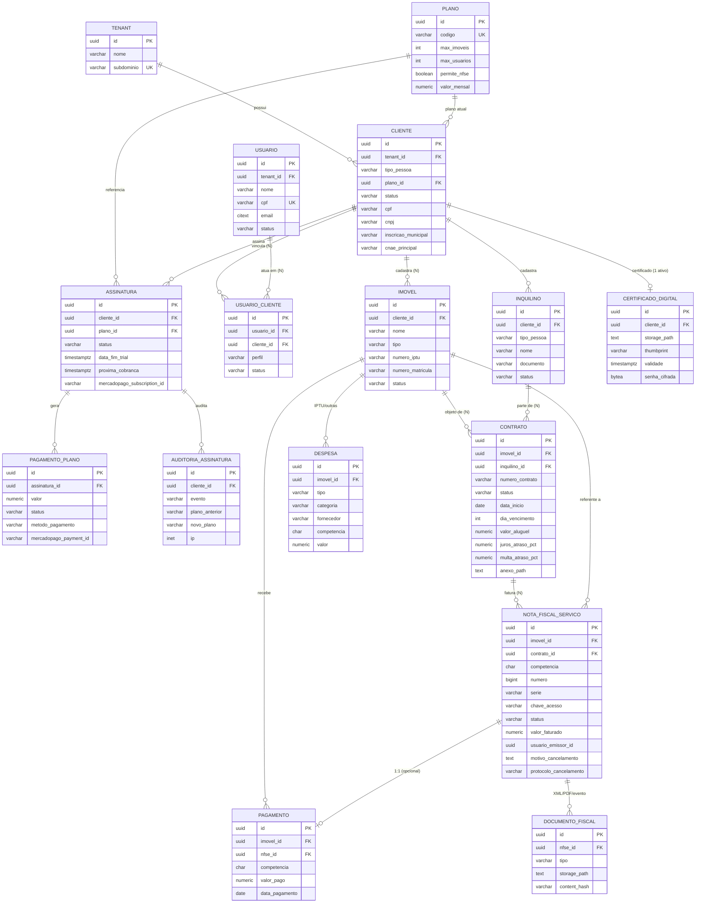
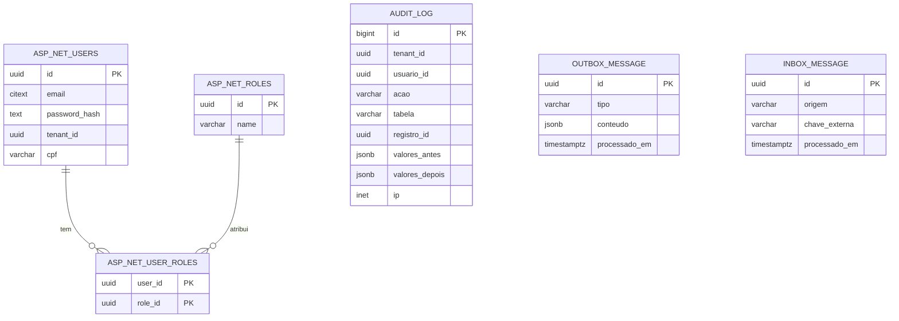

# 04 — ERD (Entity Relationship Diagram)

ERD completo, alinhado ao modelo da especificação (§15) e ao [03 — Modelo PostgreSQL](03-Modelo-PostgreSQL.md).

## 1. Resumo da especificação (§15)

```text
Cliente ├─ Imóvel (N) ├─ Usuário (N) └─ Certificado (1)
Imóvel    └─ Contrato (N)
Inquilino └─ Contrato (N)
Contrato  ├─ NFS-e (N)
NFS-e (1:1) Pagamentos
AuditLog
```

## 2. Diagrama de domínio



## 3. Infraestrutura (sem FK ao domínio) e Identity



> `USUARIO` (domínio) = `ASP_NET_USERS` estendido (`AppUser : IdentityUser<Guid>`), mantido no schema `identity`. A atuação em cada cliente é `app.usuario_cliente` (perfil e status por vinculação).

## 4. Cardinalidades e regras

| Relacionamento | Cardinalidade | Regra |
|---|---|---|
| `cliente` → `imovel` | 1 : N | Limitado por `plano.max_imoveis` (CASO 2). |
| `cliente` → `usuario_cliente` → `usuario` | N : N | CPF identifica a pessoa (único no tenant). Um CPF não se repete no mesmo cliente (CASO 1); o mesmo CPF pode atuar em vários clientes, cada um com seu perfil. `plano.max_usuarios` conta vinculações ativas. |
| `cliente` → `certificado_digital` | 1 : 0..1 ativo | Obrigatório para emitir NFS-e. |
| `imovel` → `contrato` | 1 : N (1 ativo) | Só 1 contrato `Ativo` por imóvel ⇒ 1 inquilino por vez (CASO 3). |
| `contrato` → `nota_fiscal_servico` | 1 : N | 1 faturamento não-cancelado por competência (CASO 6/7/8). |
| `nota_fiscal_servico` → `pagamento` | 1 : 0..1 | `pagamento.nfse_id` opcional (§12). |
| `nota_fiscal_servico` → `documento_fiscal` | 1 : N | XML, PDF e XML do evento de cancelamento. |
| `imovel` → `pagamento` / `despesa` | 1 : N | Pagamento único por competência (CASO 6). |
| `assinatura` → `pagamento_plano` | 1 : N | Cobranças Mercado Pago. |

Próximo: [05 — Entidades do Entity Framework](05-Entidades-EntityFramework.md).
