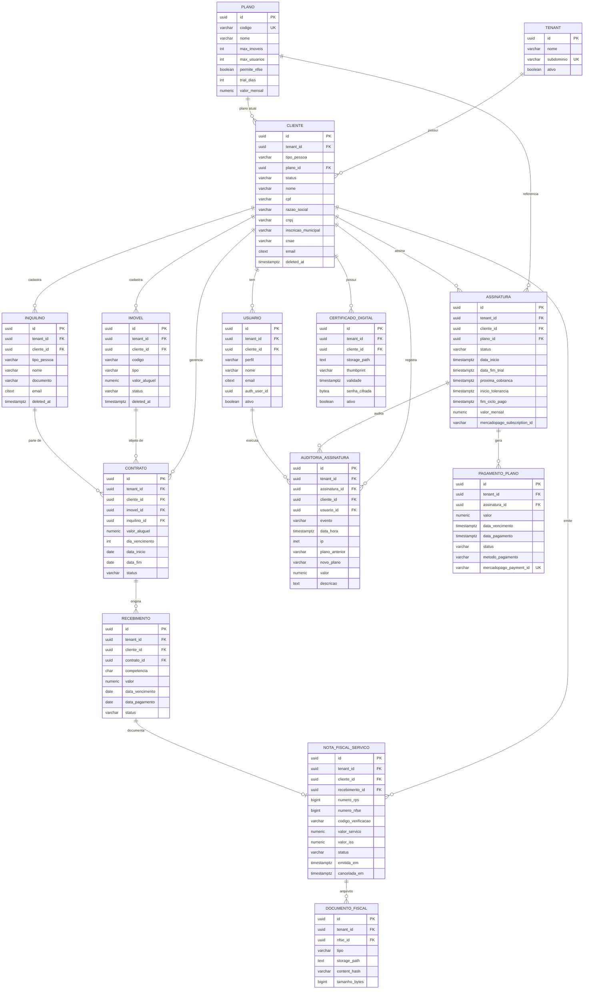
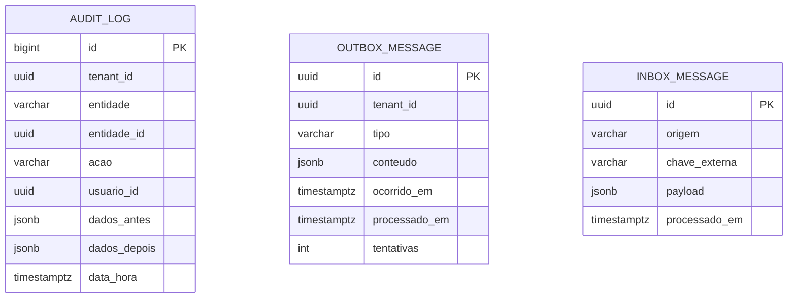

# 04 — ERD (Entity Relationship Diagram)

Diagrama entidade-relacionamento completo da plataforma APP Aluguel. Renderiza no GitHub/Cursor (Mermaid).

## 1. Diagrama completo

## 2. Tabelas de infraestrutura (não relacionadas por FK ao domínio)

## 3. Cardinalidades e regras

| Relacionamento | Cardinalidade | Regra de negócio |
|---|---|---|
| `tenant` → `cliente` | 1 : N | Isolamento multi-tenant; na prática 1 conta = 1 cliente principal. |
| `plano` → `cliente` | 1 : N | Plano vigente do cliente (limites de imóveis/usuários). |
| `cliente` → `usuario` | 1 : N | Limitado por `plano.max_usuarios`. |
| `cliente` → `assinatura` | 1 : N (1 vigente) | Índice único garante 1 assinatura em Trial/Pendente/Ativa. |
| `assinatura` → `pagamento_plano` | 1 : N | Histórico de cobranças Mercado Pago. |
| `assinatura`/`cliente` → `auditoria_assinatura` | 1 : N | Um registro por transição de estado. |
| `cliente` → `imovel` | 1 : N | Limitado por `plano.max_imoveis`. |
| `cliente` → `inquilino` | 1 : N | — |
| `imovel` + `inquilino` → `contrato` | N : 1 cada | Um contrato liga um imóvel a um inquilino. |
| `contrato` → `recebimento` | 1 : N | Uma parcela por competência (índice único). |
| `recebimento` → `nota_fiscal_servico` | 1 : 0..1 | NFS-e opcional, só em planos com `permite_nfse`. |
| `nota_fiscal_servico` → `documento_fiscal` | 1 : N | XML, PDF e RPS armazenados no Supabase Storage. |
| `cliente` → `certificado_digital` | 1 : N (1 ativo) | Certificado A1 obrigatório para emitir NFS-e. |

## 4. Notas de integridade

- Todas as FKs de negócio carregam também `tenant_id` para reforço de isolamento e índices compostos eficientes.
- `deleted_at` implementa *soft delete* — no cancelamento de assinatura os dados são preservados (exigência da especificação).
- Chaves de idempotência: `pagamento_plano.mercadopago_payment_id` (único) e `inbox_message(origem, chave_externa)` (único).

Próximo: [05 — Entidades do Entity Framework](05-Entidades-EntityFramework.md).
