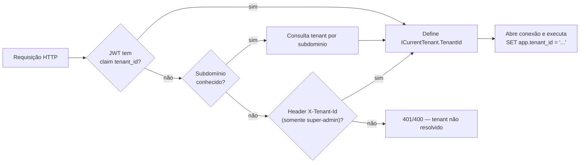

# 06 — Estratégia Multi-Tenant

## 1. Modelo escolhido

**Banco único, schema único, discriminador `tenant_id`** (*shared database, shared schema*), com **defesa em profundidade** em três camadas:

1. **Aplicação** — `ICurrentTenant` resolve o tenant da requisição e alimenta *global query filters* do EF Core.
2. **Banco (RLS)** — políticas de *Row Level Security* garantem isolamento mesmo diante de bug de aplicação ou consulta *ad hoc*.
3. **Storage** — prefixo de caminho por tenant + buckets privados (ver [07](07-Estrategia-Supabase-Storage.md)).

### Por que não *database-per-tenant* ou *schema-per-tenant*?

| Critério | Shared (escolhido) | Schema/DB por tenant |
|---|---|---|
| Custo no Supabase | Baixo (1 banco) | Alto (limites de conexão/projeto) |
| Migrations | 1 execução | N execuções |
| Onboarding de tenant | Instantâneo (INSERT) | Provisionamento pesado |
| Isolamento | Lógico (RLS) | Físico |
| Volume esperado | Muitos tenants pequenos | Poucos tenants grandes |

O perfil do produto (muitas contas pequenas de locadores) favorece o modelo compartilhado. Caso um tenant "Pro" cresça muito, é possível migrá-lo isoladamente no futuro sem mudar o código de domínio.

## 2. Resolução do tenant

Ordem de precedência no `TenantMiddleware` / `TenantResolver`:



- **Fonte canônica**: claim `tenant_id` embutido no JWT no login (ver [08](08-Estrategia-Autenticacao.md)). O subdomínio serve para rotear a tela de login correta.
- Requisições sem tenant válido são rejeitadas, exceto rotas públicas (login, health, webhook — este último resolve o tenant pelo dado do evento).

```csharp
public interface ICurrentTenant
{
    Guid TenantId { get; }
    bool IsResolved { get; }
}
```

## 3. EF Core — filtro global

Aplicado automaticamente a toda entidade `ITenantOwned` (ver doc 05, `OnModelCreating`):

```csharp
public static void AddTenantFilter(this IMutableEntityType et, ICurrentTenant tenant)
{
    // gera: e => EF.Property<Guid>(e, "TenantId") == tenant.TenantId
}
```

Efeito: **toda** query (`Where`, `Find`, navegações) é filtrada por tenant sem o desenvolvedor precisar lembrar. Inserts recebem `TenantId` via `TenantSaveInterceptor`.

> Operações administrativas de plataforma (super-admin da Lucrare) usam um `DbContext` com filtro desabilitado (`IgnoreQueryFilters()`), sempre auditadas.

## 4. Reforço no banco — RLS

Ativado em todas as tabelas `tenant_id`. A conexão define a variável de sessão `app.tenant_id`; as políticas comparam contra ela.

```sql
-- Executado pela aplicação ao adquirir a conexão (RlsConnectionInterceptor):
SET app.tenant_id = '00000000-0000-0000-0000-000000000000';

-- Padrão de política aplicado a cada tabela:
ALTER TABLE app.cliente     ENABLE ROW LEVEL SECURITY;
ALTER TABLE app.cliente     FORCE ROW LEVEL SECURITY;   -- vale até para o owner da tabela

CREATE POLICY tenant_isolation_cliente ON app.cliente
    USING       (tenant_id = current_setting('app.tenant_id', true)::uuid)
    WITH CHECK  (tenant_id = current_setting('app.tenant_id', true)::uuid);
```

Repetir para: `usuario_cliente`, `assinatura`, `pagamento_plano`, `auditoria_assinatura`, `imovel`, `inquilino`, `contrato`, `recebimento`, `certificado_digital`, `nota_fiscal_servico`, `documento_fiscal`.

> `current_setting('app.tenant_id', true)` retorna `NULL` quando não definido → nenhuma linha é retornada (falha segura). Um *role* de migração/serviço com `BYPASSRLS` é usado apenas para manutenção controlada.

### Papéis de banco

| Role | Uso | RLS |
|---|---|---|
| `app_runtime` | Conexões da API/Worker | Sujeito às políticas |
| `app_migrator` | Migrations/DDL | `BYPASSRLS` (somente pipeline) |
| `app_admin` | Suporte/plataforma | `BYPASSRLS`, auditado |

## 5. Aplicação de limites de plano

O tenant/cliente tem um `plano` com `max_imoveis` e `max_usuarios`. A verificação ocorre na **camada de aplicação** (comandos), antes de persistir:

```csharp
// Ex.: CriarImovelCommandHandler
var plano = await _planos.ObterDoClienteAsync(clienteId, ct);
var qtd   = await _imoveis.ContarAtivosAsync(clienteId, ct);
if (plano.MaxImoveis is int max && qtd >= max)
    throw new PlanoLimiteExcedidoException("imóveis", max);
```

- **Downgrade** valida limites antes de trocar o plano; se exceder, é bloqueado com alerta para inativar imóveis/usuários (**CASO 2**).
- **Plano sem NFS-e** (Básico/Trial): emissão bloqueada por policy `PlanoComNfse` (**CASO 4**).
- **Suspensa**: `AssinaturaSuspensaGuard` bloqueia todas as rotas exceto Login, Minha Conta e Pagamentos, redirecionando para pagamento (**CASO 5**).

```csharp
// AssinaturaSuspensaGuard (resumo)
if (assinatura.Status == StatusAssinatura.Suspensa && !RotaLiberadaNaSuspensao(path))
    return Results.Problem(statusCode: 402, title: "Assinatura suspensa — regularize o pagamento");
```

### Critérios de aceite ligados a tenant/plano

| Critério | Garantia |
|---|---|
| CASO 1 — CPF único por cliente | `ux_usuario_cpf_tenant` + unique `(cliente_id, usuario_id)` + validação |
| CASO 2 — downgrade x utilização | validação de aplicação (acima) |
| CASO 3 — 1 contrato ativo por imóvel | índice `ux_contrato_imovel_ativo` |
| CASO 4 — plano sem NFS-e | `plano.permite_nfse` + policy |
| CASO 5 — suspensa bloqueia Home | `AssinaturaSuspensaGuard` |
| CASO 6/7/8 — competência/faturamento | índices únicos parciais (doc 03) |

## 6. Considerações Supabase

- O PostgreSQL do Supabase suporta RLS nativamente (é o mesmo mecanismo do PostgREST). Como o acesso é feito pelo backend .NET (não pelo PostgREST anônimo), definimos `app.tenant_id` explicitamente por conexão.
- **Pooling**: com PgBouncer em modo *transaction*, `SET` de sessão não persiste entre transações. Solução: usar `SET LOCAL app.tenant_id` **dentro** da transação (o `RlsConnectionInterceptor`/`TransactionBehavior` o faz no início de cada `SaveChanges`/transação), **ou** conectar em modo *session* para o runtime. Documentar a escolha no deploy.

## 7. Testes de isolamento

- **Integração (Testcontainers)**: criar 2 tenants, inserir dados, confirmar que consultas de um nunca enxergam o outro (com e sem filtro EF, validando a RLS diretamente).
- **Teste negativo**: forçar `tenant_id` divergente em `WITH CHECK` deve falhar o INSERT.
- **Teste de fuga**: query crua sem `SET app.tenant_id` retorna zero linhas.

Próximo: [07 — Estratégia Supabase Storage](07-Estrategia-Supabase-Storage.md).
