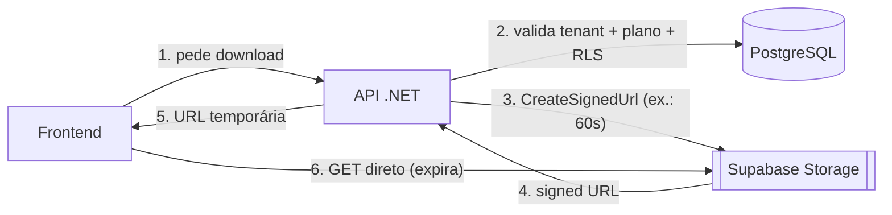
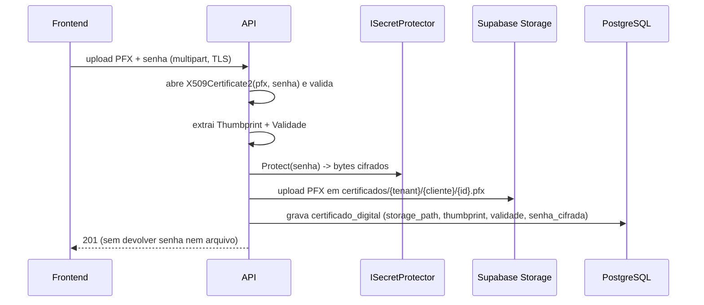

# 07 — Estratégia de Supabase Storage

Armazenamento de arquivos fiscais (XML/PDF de NFS-e, RPS) e **certificados digitais A1 (PFX/P12)**. Requisitos da especificação: armazenamento **criptografado**, uso **apenas pelo backend**, **nunca** expor a senha do certificado ao frontend.

> Referência oficial (verificada): Supabase Storage é **S3-compatible** via endpoint `https://<project_ref>.storage.supabase.co/storage/v1/s3` (Signature V4, `forcePathStyle`), com credenciais *server-side* (Access Key/Secret) de acesso total **apenas no backend**, além de credenciais escopadas por usuário via RLS + *session token*. Também há o SDK `supabase-csharp` (`CreateSignedUrl`, `CreateUploadSignedUrl`, `UploadToSignedUrl`).

## 1. Princípios

1. **Todos os buckets são privados.** Nenhum arquivo fiscal ou certificado é público.
2. **Acesso mediado pelo backend.** O frontend nunca recebe credenciais do Storage; recebe apenas *signed URLs* de curta duração emitidas pela API.
3. **Isolamento por tenant** no caminho (path) do objeto + políticas de Storage.
4. **Defesa em profundidade para o certificado**: o arquivo PFX fica no Storage; a **senha** fica no banco criptografada (`certificado_digital.senha_cifrada`) com chave gerenciada pela aplicação (`ISecretProtector`), nunca no Storage nem no frontend.

## 2. Buckets (§16)

Os cinco buckets são exatamente os definidos na especificação. Todos **privados**.

| Bucket | Conteúdo | Retenção |
|---|---|---|
| `contracts` | Contratos de aluguel anexados (§9) | Configurável |
| `certificates` | Certificados A1 (PFX/P12) dos clientes | Enquanto válido + histórico |
| `nfse-xml` | XML de NFS-e e XML do evento de cancelamento | Legal (mín. 5 anos) |
| `nfse-pdf` | PDF (DANFSe) das NFS-e | Legal |
| `reports` | Relatórios/exportações geradas (XLSX/CSV/PDF) | Temporária |

## 3. Convenção de caminho (path)

Prefixo sempre iniciando pelo `tenant_id`, permitindo políticas de Storage baseadas no primeiro segmento:

```text
contracts/{tenant_id}/{cliente_id}/{contrato_id}.pdf
certificates/{tenant_id}/{cliente_id}/{certificado_id}.pfx
nfse-xml/{tenant_id}/{cliente_id}/{ano}/{mes}/{nfse_id}.xml
nfse-xml/{tenant_id}/{cliente_id}/{ano}/{mes}/{nfse_id}-cancelamento.xml
nfse-pdf/{tenant_id}/{cliente_id}/{ano}/{mes}/{nfse_id}.pdf
reports/{tenant_id}/{usuario_id}/{report_id}.xlsx
```

Os metadados (path, hash, tamanho) ficam em `documento_fiscal` / `certificado_digital` (doc 03), que são a fonte de verdade e respeitam a RLS do PostgreSQL.

## 4. Modelo de acesso



- **Upload de certificado**: multipart chega **à API** (não direto ao Storage), que valida o PFX (abre com a senha, extrai *thumbprint* e validade), criptografa a senha, faz o *upload server-side* e grava metadados. Assim a senha nunca transita pelo cliente.
- **Download de XML/PDF**: a API emite *signed URL* de curta duração após checar RLS/tenant/plano.
- **Nunca** usamos bucket público nem *signed URL* de longa duração para conteúdo fiscal.

## 5. Adapter `IFileStorage` (port da Application)

```csharp
public interface IFileStorage
{
    Task<string> UploadAsync(string bucket, string path, Stream conteudo, string contentType, CancellationToken ct);
    Task<Stream> DownloadAsync(string bucket, string path, CancellationToken ct);         // uso interno (worker fiscal)
    Task<Uri> CreateSignedUrlAsync(string bucket, string path, TimeSpan expiresIn, CancellationToken ct);
    Task DeleteAsync(string bucket, string path, CancellationToken ct);
}
```

Implementação recomendada em `Infrastructure/Integrations/Storage/SupabaseStorage`. Duas opções, ambas *server-side*:

- **A) SDK `supabase-csharp`** — `client.Storage.From(bucket).CreateSignedUrl(path, expiresIn)` / `Upload(bytes, path)`. Simples e alinhado à doc oficial.
- **B) `AWSSDK.S3`** apontando ao endpoint S3 do Supabase (`ForcePathStyle = true`, `SignatureVersion = s3v4`) — útil para *streaming* de arquivos grandes e uploads resumíveis (TUS/multipart).

A escolha é encapsulada no adapter; o domínio só conhece `IFileStorage`.

```csharp
// Exemplo (AWSSDK.S3):
var s3 = new AmazonS3Client(accessKey, secretKey, new AmazonS3Config {
    ServiceURL = "https://<project_ref>.storage.supabase.co/storage/v1/s3",
    ForcePathStyle = true,
    AuthenticationRegion = "sa-east-1"
});
```

## 6. Segurança do certificado A1



- `ISecretProtector` usa **AES-GCM** com chave de aplicação (env var / Key Vault) ou **ASP.NET Core Data Protection** com chaves persistidas fora do repositório.
- Na emissão de NFS-e, o **Worker** baixa o PFX, descriptografa a senha **em memória**, assina o XML e descarta o material sensível (`X509Certificate2` em `using`; buffers zerados).
- Rotação: novo certificado gera novo registro `ativo=true` e desativa o anterior; PFX antigo pode ser mantido para reprocessamento.

## 7. Políticas de RLS no Storage

Além do backend mediar o acesso, aplicamos políticas em `storage.objects` para o caso de credenciais escopadas por usuário (defesa extra), usando o primeiro segmento do path como `tenant_id`:

```sql
-- Leitura restrita ao tenant (quando acesso via session token do usuário)
CREATE POLICY "tenant_read_nfse_pdf"
ON storage.objects FOR SELECT
USING (
    bucket_id = 'nfse-pdf'
    AND (storage.foldername(name))[1] = (auth.jwt() ->> 'tenant_id')
);

-- Escrita apenas pelo role de serviço (uploads server-side)
CREATE POLICY "service_write_nfse_xml"
ON storage.objects FOR INSERT
WITH CHECK ( bucket_id = 'nfse-xml' AND auth.role() = 'service_role' );
```

> Como o backend .NET roda em **Render/Azure** (fora da borda do Supabase), o acesso padrão é **server-side** com Access Key/Secret; o app emite *signed URLs* para o frontend. As políticas acima valem caso se opte por credenciais escopadas por usuário. O bucket `certificates` **nunca** recebe política de leitura por usuário — acesso somente pelo backend.

## 8. Backup, integridade e LGPD

- **Integridade**: gravamos `content_hash` (SHA-256) em `documento_fiscal`; validado no download interno.
- **Backup**: replicação/*lifecycle* do Storage + export periódico dos documentos fiscais para *cold storage* (retenção legal).
- **LGPD/retenção**: exclusão de documentos segue prazos legais; no cancelamento de assinatura os arquivos **não** são apagados (coerente com "os dados não devem ser excluídos").

## 9. Configuração (env vars)

```text
SUPABASE_URL=https://<project_ref>.supabase.co
SUPABASE_STORAGE_S3_ENDPOINT=https://<project_ref>.storage.supabase.co/storage/v1/s3
SUPABASE_STORAGE_REGION=sa-east-1
SUPABASE_STORAGE_ACCESS_KEY=***        # secret (server-side only)
SUPABASE_STORAGE_SECRET_KEY=***        # secret (server-side only)
CERT_PROTECTOR_KEY=***                 # chave AES para senha do PFX
```

Segredos ficam em variáveis de ambiente / *secret manager*, nunca no repositório.

Próximo: [08 — Estratégia de Autenticação](08-Estrategia-Autenticacao.md).
