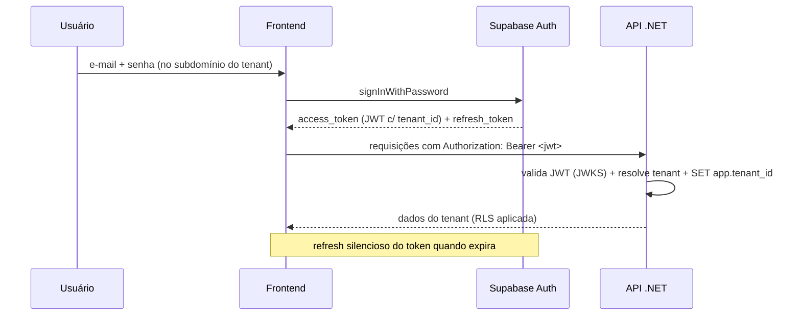

# 08 — Estratégia de Autenticação e Autorização

## 1. Decisão

**Autenticação delegada ao Supabase Auth (GoTrue)** como *Identity Provider*, emitindo **JWT** (access token + refresh token). A **API .NET valida** o token localmente via **JWKS** (chaves públicas do projeto) — *stateless*, sem chamada de rede por requisição.

Justificativa: o projeto já usa Supabase (Postgres + Storage); reaproveitar o Auth reduz superfície de segurança (sem armazenar/validar senhas próprias), habilita recuperação de senha, verificação de e-mail, MFA e OAuth social prontos, e integra com a RLS do banco/Storage via claims.

> A especificação lista um campo `Senha` em `Usuário`. **Não** persistimos senha no domínio: a credencial vive no Supabase Auth. A tabela `usuario` guarda apenas `auth_user_id` (vínculo) e o perfil/negócio.

### Alternativa considerada

**ASP.NET Core Identity + JWT próprio**: maior controle, porém exige gerir hashing, reset, e-mail, MFA e rotação de chaves. Mantido como *plano B* caso haja requisito de não-dependência do Supabase Auth. O contrato (`ICurrentUser`, claims) é o mesmo, então a troca não afeta o domínio.

## 2. Claims e multi-tenant

O JWT precisa carregar o contexto de tenant/cliente/perfil. Isso é feito com um **Access Token Hook** (função Postgres registrada no Supabase Auth) que injeta *custom claims* a partir de `app.usuario`:

```json
{
  "sub": "auth-user-uuid",
  "email": "admin@cliente.com",
  "tenant_id": "TENANT-UUID",
  "cliente_id": "CLIENTE-UUID",
  "perfil": "Admin",
  "role": "authenticated",
  "exp": 1788620000
}
```

```sql
-- Access token hook (resumo): adiciona tenant_id/cliente_id/perfil ao JWT
create or replace function app.custom_access_token(event jsonb)
returns jsonb language plpgsql as $$
declare claims jsonb; u app.usuario%rowtype;
begin
  select * into u from app.usuario where auth_user_id = (event->>'user_id')::uuid and ativo;
  claims := event->'claims';
  if found then
    claims := jsonb_set(claims, '{tenant_id}', to_jsonb(u.tenant_id));
    claims := jsonb_set(claims, '{cliente_id}', to_jsonb(u.cliente_id));
    claims := jsonb_set(claims, '{perfil}', to_jsonb(u.perfil));
  end if;
  return jsonb_set(event, '{claims}', claims);
end; $$;
```

Esses claims alimentam:
- `ICurrentTenant.TenantId` (filtro EF + `SET app.tenant_id` para RLS — doc 06);
- `ICurrentUser` (cliente/perfil/id) para autorização e auditoria (`ip`, `usuario_id`).

## 3. Validação na API (.NET)

```csharp
builder.Services.AddAuthentication(JwtBearerDefaults.AuthenticationScheme)
    .AddJwtBearer(o =>
    {
        o.Authority = $"{supabaseUrl}/auth/v1";          // emissor
        o.MetadataAddress = $"{supabaseUrl}/auth/v1/.well-known/jwks.json";
        o.TokenValidationParameters = new()
        {
            ValidateIssuer = true,
            ValidIssuer = $"{supabaseUrl}/auth/v1",
            ValidateAudience = true,
            ValidAudience = "authenticated",
            ValidateLifetime = true,
            ValidateIssuerSigningKey = true,
            RoleClaimType = "perfil"
        };
    });
```

`TenantMiddleware` lê `tenant_id`/`cliente_id`/`perfil` do `ClaimsPrincipal` e popula os serviços *scoped* `ICurrentTenant`/`ICurrentUser`.

## 4. Autorização

Combina **perfil** (RBAC) e **estado da assinatura** (plano).

```csharp
// Policies por perfil
options.AddPolicy("PodeEmitirNfse", p => p.RequireRole("Admin", "Financeiro"));
options.AddPolicy("GerenciaUsuarios", p => p.RequireRole("Admin"));

// Requisito de assinatura ativa/plano com NFS-e
options.AddPolicy("AssinaturaAtiva", p => p.AddRequirements(new AssinaturaAtivaRequirement()));
options.AddPolicy("PlanoComNfse",   p => p.AddRequirements(new PlanoPermiteNfseRequirement()));
```

| Perfil | Permissões (baseadas no "Usuário Administrador" da spec) |
|---|---|
| `Admin` | Gerenciar clientes, usuários, imóveis, inquilinos; emitir/cancelar NFS-e; assinatura. |
| `Financeiro` | Recebimentos, emitir NFS-e, pagamentos. |
| `Operador` | Imóveis, inquilinos, contratos (sem NFS-e). |
| `Leitura` | Somente consulta/dashboard. |

**Guarda de estado** (`PlanoGuardMiddleware`, doc 06): quando `Suspensa`, só passam Login, Minha Conta e Pagamentos; emissão de NFS-e exige `PlanoComNfse` + `AssinaturaAtiva`.

## 5. Fluxo de login



- **Provisionamento**: ao criar um `Usuario`, a API chama a Admin API do Supabase Auth (`service_role`) para criar o usuário no IdP e grava `auth_user_id`. Convite por e-mail define a senha.
- **Refresh tokens**: gerenciados pelo cliente Supabase no frontend; a API é *stateless*.

## 6. Segurança de webhooks (Mercado Pago)

O endpoint de webhook **não** usa JWT de usuário. Autenticação por:
1. **Validação de assinatura HMAC** do header `x-signature`/`x-request-id` do Mercado Pago (segredo do webhook).
2. **Idempotência** via `inbox_message(origem, chave_externa)`.
3. Resolução de tenant a partir do `mercadopago_subscription_id`/`payment_id` → assinatura → tenant.

```csharp
[AllowAnonymous]
[HttpPost("/webhooks/mercadopago")]
public async Task<IResult> Receber([FromHeader(Name="x-signature")] string assinatura, ...)
{
    if (!_mp.ValidarAssinatura(assinatura, requestId, corpo)) return Results.Unauthorized();
    // grava Inbox (idempotente) + Outbox e responde 200 rápido
}
```

## 7. Segredos e chaves

| Segredo | Uso | Onde |
|---|---|---|
| `SUPABASE_JWT_SECRET` / JWKS | validar tokens | env / metadata pública |
| `SUPABASE_SERVICE_ROLE_KEY` | Admin API (criar usuários), uploads server-side | *secret manager* |
| `MERCADOPAGO_WEBHOOK_SECRET` | validar webhook | *secret manager* |
| `CERT_PROTECTOR_KEY` | cifrar senha do certificado | *secret manager* |

- TLS obrigatório fim-a-fim; tokens de curta duração; *refresh* rotativo.
- **MFA** (TOTP) recomendado para perfil `Admin` (suportado pelo Supabase Auth).
- Logs de autenticação e ações sensíveis vão para `audit_log`/`auditoria_assinatura` com `ip` e `usuario_id`.

## 8. Resumo da relação com RLS/Storage

O mesmo JWT que autentica na API carrega `tenant_id`, que: (a) filtra o EF Core, (b) define `app.tenant_id` para a RLS do PostgreSQL (doc 06) e (c) pode escopar credenciais de Storage por usuário quando aplicável (doc 07). Uma única identidade, isolamento consistente em todas as camadas.

Próximo: [09 — Plano de Implementação (Sprints)](09-Plano-de-Implementacao-Sprints.md).
