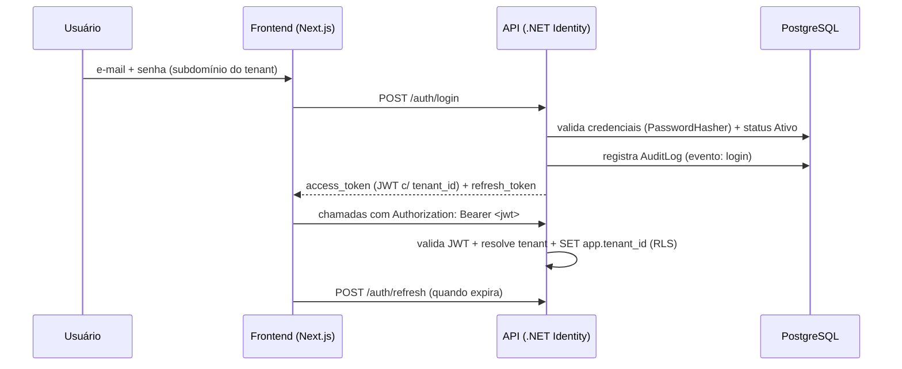

# 08 — Estratégia de Autenticação e Autorização

## 1. Decisão (conforme stack §19)

**Autenticação própria com ASP.NET Core Identity + JWT.** O backend .NET gerencia usuários, senhas (hash), e-mail, MFA e emite **access tokens JWT** (+ *refresh tokens*). Não há dependência de IdP externo — coerente com a stack aprovada (`.NET 9 Web API`, `EF Core`, `JWT`, `ASP.NET Identity`).

- **Identity**: `AppUser : IdentityUser<Guid>` + `AppRole : IdentityRole<Guid>` (tabelas no schema `identity`, doc 03/05). A **senha** citada na §6 é o `PasswordHash` do Identity — nunca em texto puro.
- **Hashing**: `PasswordHasher` do Identity (PBKDF2) com *lockout* por tentativas.
- **MFA opcional** (§14): TOTP via `Microsoft.AspNetCore.Identity` (recomendado para `Gestor`/`AdminSistema`).

> **Nota (Supabase):** o projeto usa Supabase apenas para **PostgreSQL + Storage**. O Supabase Auth **não** é utilizado; a identidade é emitida pela API. Caso o Storage use políticas por usuário, a integração é feita por credenciais de serviço (doc 07).

## 2. Perfis e regras de acesso (§4, §6)

> **Implementado (Sprint 1):** roles do Identity `Administrador`, `Gestor`, `Analista` (nomes coincidem com `PerfilUsuario`); endpoints `POST /api/auth/login`, `POST /api/auth/refresh`, `POST /api/auth/logout` (+ `GET /api/auth/me`); JWT HS256 com refresh tokens rotativos persistidos em `identity.refresh_token`; autorização por role via `[Authorize]`/políticas. Claim de role = `role`; `MapInboundClaims=false`.

| Perfil | Escopo | Permissões |
|---|---|---|
| **Administrador** | Plataforma (Lucrare) | Tudo; gestão de clientes/usuários/imóveis/inquilinos; emissão/cancelamento de NFS-e; registrar pagamento. Remoção só se não houver dependentes. Menu **Clientes**. |
| **Gestor** | Um cliente | Editar dados do próprio cliente (inclui mudar de plano); CRUD de usuários do cliente; CRUD de imóveis/inquilinos/contratos; emitir NFS-e; consultar histórico. Menu **Minha Conta**. |
| **Analista** | Um cliente | Consultar imóveis/inquilinos; emitir NFS-e; consultar histórico; **cancelar NFS-e**. |

Regra crítica (§6): **um usuário nunca vê dados de outro cliente**, mesmo sendo `Gestor` — garantido por `tenant_id`/`cliente_id` no token + RLS (doc 06).

`StatusUsuario`: `Ativo`, `Inativo`, `Bloqueado` (bloqueado/inativo não autentica).

## 3. Claims do JWT (multi-tenant)

O *token service* emite claims a partir de `AppUser`:

```json
{
  "sub": "usuario-uuid",
  "email": "gestor@cliente.com",
  "name": "Gestor Demo",
  "tenant_id": "TENANT-UUID",
  "cliente_id": "CLIENTE-UUID",
  "role": "Gestor",
  "exp": 1788620000,
  "jti": "..."
}
```

Esses claims alimentam `ICurrentTenant` (filtro EF + `SET app.tenant_id` para RLS — doc 06) e `ICurrentUser` (autorização + auditoria com `usuario_id`/`ip`).

```csharp
public class JwtTokenService
{
    public string GerarAccessToken(AppUser u) => /* claims: sub, email, tenant_id, cliente_id, perfil */;
    public (string refresh, DateTimeOffset exp) GerarRefreshToken(AppUser u);
}
```

## 4. Configuração na API

```csharp
builder.Services
    .AddIdentityCore<AppUser>(o => {
        o.Password.RequiredLength = 10;
        o.User.RequireUniqueEmail = true;
        o.Lockout.MaxFailedAccessAttempts = 5;
        o.SignIn.RequireConfirmedEmail = true;
    })
    .AddRoles<AppRole>()
    .AddEntityFrameworkStores<AppDbContext>()
    .AddDefaultTokenProviders();   // e-mail, reset, TOTP (MFA)

builder.Services.AddAuthentication(JwtBearerDefaults.AuthenticationScheme)
    .AddJwtBearer(o =>
    {
        o.TokenValidationParameters = new()
        {
            ValidateIssuer = true, ValidIssuer = cfg["Jwt:Issuer"],
            ValidateAudience = true, ValidAudience = cfg["Jwt:Audience"],
            ValidateLifetime = true,
            ValidateIssuerSigningKey = true,
            IssuerSigningKey = new SymmetricSecurityKey(key),   // ou chave assimétrica (RSA/ECDSA)
            RoleClaimType = "role",
            NameClaimType = "name"
        };
        o.MapInboundClaims = false;   // preserva os nomes de claim (role, tenant_id, ...)
    });
```

## 5. Autorização (RBAC + estado da assinatura)

```csharp
// Implementado (Sprint 1):
options.AddPolicy("GerenciaUsuarios", p => p.RequireRole("Administrador", "Gestor"));
options.AddPolicy("EmitirNfse",       p => p.RequireRole("Administrador", "Gestor", "Analista"));
options.AddPolicy("CancelarNfse",     p => p.RequireRole("Administrador", "Gestor", "Analista"));
// Planejado:
options.AddPolicy("PlanoComNfse",     p => p.AddRequirements(new PlanoPermiteNfseRequirement()));   // CASO 4
options.AddPolicy("AssinaturaAtiva",  p => p.AddRequirements(new AssinaturaAtivaRequirement()));    // CASO 5
```

`AssinaturaSuspensaGuard` (middleware) libera apenas Login, Minha Conta e Pagamentos quando `Suspensa`, redirecionando para pagamento (**CASO 5**).

## 6. Fluxo de login e refresh



- **Provisionamento (§6)**: ao criar `Cliente` PF, o primeiro `AppUser` coincide com o cliente e recebe `Gestor`. `Gestor` cria demais usuários conforme `plano.max_usuarios`.
- **Refresh tokens** persistidos/rotacionados (revogáveis); *logout* revoga o refresh.

## 7. Segurança de webhooks (Mercado Pago)

Endpoint **sem** JWT de usuário. Autenticação por: (1) **HMAC** do header `x-signature`/`x-request-id`; (2) idempotência via `inbox_message(origem, chave_externa)`; (3) resolução de tenant via `mercadopago_*_id` → assinatura → tenant.

```csharp
[AllowAnonymous, HttpPost("/webhooks/mercadopago")]
public async Task<IResult> Receber([FromHeader(Name="x-signature")] string sig, ...) {
    if (!_mp.ValidarAssinatura(sig, requestId, corpo)) return Results.Unauthorized();
    // grava Inbox (idempotente) + Outbox; responde 200 rápido
}
```

## 8. Segredos e conformidade

| Segredo | Uso |
|---|---|
| `JWT_SIGNING_KEY` (ou par RSA) | assinar/validar tokens |
| `MERCADOPAGO_WEBHOOK_SECRET` | validar webhook |
| `SUPABASE_STORAGE_ACCESS/SECRET_KEY` | uploads server-side |
| `CERT_PROTECTOR_KEY` | cifrar senha do certificado A1 |

- **HTTPS obrigatório** (§14); tokens curtos + refresh rotativo; *rate limiting* no login.
- **Auditoria (§13)**: `login`, `emissão`, `cancelamento`, `pagamento`, `despesas`, `alteração cadastral` em `audit_log` (usuário, data, hora, ação, IP, valores antes/depois).
- **LGPD**: mínimo necessário de dados; *soft delete*; trilha de auditoria.

## 9. Integração com RLS/Storage

O mesmo JWT que autentica carrega `tenant_id`, que: (a) filtra o EF Core, (b) define `app.tenant_id` para a RLS (doc 06) e (c) escopa o acesso ao Storage por tenant (doc 07). Identidade única, isolamento consistente — atendendo à **segregação total entre tenants** (§14).

Próximo: [09 — Plano de Implementação (Sprints)](09-Plano-de-Implementacao-Sprints.md).
