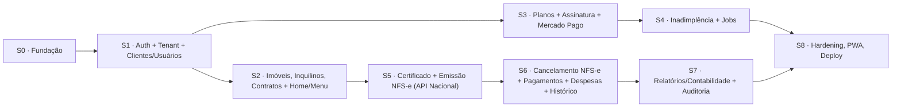

# 09 — Plano de Implementação (Sprints)

Incrementos verticais alinhados à **prioridade de MVP (§20)**, aos **casos de uso (§17)** e aos **critérios de aceite BDD (§18)**. Cada sprint tem objetivo, entregáveis e *Definition of Done*. São iterações de escopo fechado (a equipe define o *time-box*); a ordem respeita as dependências técnicas.

## Prioridade de MVP (§20)

`1. Home · 2. Menu · 3. Clientes · 4. Usuários · 5. Imóveis · 6. Inquilinos · 7. Controle de planos · 8. Emissão de NFS-e · 9. Histórico · 10. Registro de pagamentos · 11. Relatórios básicos`

---

## Sprint 0 — Fundação técnica
**Objetivo:** esqueleto pronto para features.
- Solução .NET 9 (`Domain/Application/Infrastructure/Api/Worker`) + repositório frontend Next.js 15.
- Docker Compose (Postgres + Redis) + projeto Supabase (staging).
- `AppDbContext` (IdentityDbContext) + naming snake_case + migration inicial (`tenant`, `plano` seed).
- CI (build, testes, format, migrations bundle); Serilog + HealthChecks + Swagger; ProblemDetails.

**DoD:** `docker compose up` sobe API/Worker; migration aplica; CI verde; `/health` OK.

---

## Sprint 1 — Autenticação, Multi-tenant, Clientes e Usuários (MVP 3, 4)
**Objetivo:** login real, isolamento e cadastros de conta.
- **ASP.NET Identity + JWT** (perfis Gestor/Analista/AdminSistema, status) — doc 08.
- `ICurrentTenant/ICurrentUser`, `TenantMiddleware`, global query filter + **RLS** — doc 06.
- **UC001** Cadastrar Cliente (PF/PJ); **UC002** Criar Usuário; provisionamento do 1º usuário (Gestor) para PF.
- Interceptors (tenant, auditável, soft delete, audit log).

**DoD:** dois tenants isolados (teste EF + RLS); **CASO 1** (CPF único por cliente) coberto; login gera `AuditLog`.

---

## Sprint 2 — Imóveis, Inquilinos, Contratos + Home/Menu (MVP 1, 2, 5, 6)
**Objetivo:** núcleo operacional e tela inicial.
- **UC003** Imóvel (tipo residencial/comercial/galpão/sala; IPTU; matrícula; status).
- Inquilino (1 por imóvel por vez); **UC004** Contrato (nº, datas, vencimento, valor, juros/multa, anexo em `contracts`).
- **Home (§10)**: filtros (competência, imóvel, inquilino, NFS-e/pagamento pendente) + indicadores (faturamento, inadimplência, qtd imóveis, qtd notas) + lista de imóveis com ações.
- Menu (§13) e tema claro/escuro.

**DoD:** fluxo imóvel→contrato ponta a ponta; **CASO 3** (1 contrato ativo por imóvel) coberto; Home paginada (<2s).

---

## Sprint 3 — Planos, Assinatura e Mercado Pago (MVP 7)
**Objetivo:** contratação e cobrança recorrente.
- Agregado `Assinatura` (state machine) + `pagamento_plano`; trial de 7 dias no cadastro.
- Adapter `IPagamentoGateway` (Mercado Pago) + contratação (`PendentePagamento`→`init_point`).
- **Webhook** idempotente (Inbox) + HMAC + Outbox; ativação automática.
- Upgrade/Downgrade com validação de limites — **CASO 2**.

**DoD:** contratação em sandbox ativa via webhook; upgrade/downgrade respeitam limites; auditoria de assinatura registrada.

---

## Sprint 4 — Inadimplência e Jobs
**Objetivo:** ciclo Trial→Tolerância→Suspensão→Reativação.
- `Aluguel.Worker` (Quartz) + processador de Outbox.
- Jobs: trial expirado, tolerância (7 dias), gerar cobrança, reprocessar webhook.
- Falha de pagamento → `PendentePagamento` + e-mail/alerta; fim da tolerância → `Suspensa`; reativação automática; cancelamento mantém acesso até o fim do ciclo (dados preservados).
- `AssinaturaSuspensaGuard` — **CASO 5**.

**DoD:** simulação de inadimplência percorre todos os estados (relógio controlável via `IDateTimeProvider`).

---

## Sprint 5 — Certificado + Emissão de NFS-e (MVP 8)
**Objetivo:** emitir NFS-e via **API Nacional da NFS-e**.
- Buckets Supabase (`certificates`, `nfse-xml`, `nfse-pdf`) + `IFileStorage` (doc 07).
- Upload/validação do certificado A1 (thumbprint, validade); senha cifrada (`ISecretProtector`).
- Adapter `INfseNacionalProvider`; **UC005** Emitir NFS-e (valida plano/assinatura — **CASO 4**; valida competência — **CASO 8**).
- Faturamento `Rascunho`→`EmProcessamento`→`Emitida`; persistência de número, série, chave, XML, PDF, usuário emissor.

**DoD:** emissão em homologação retorna chave/XML/PDF; **CASO 8** (competência já faturada) bloqueado; senha do certificado nunca exposta.

---

## Sprint 6 — Cancelamento, Pagamentos, Despesas e Histórico (MVP 9, 10)
**Objetivo:** completar o ciclo fiscal e financeiro.
- **UC006** Cancelar NFS-e (motivo→evento API→protocolo→XML do evento→status `Cancelada`); log no histórico.
- **CASO 7**: após cancelada, permitir nova emissão na mesma competência.
- **UC007** Registrar Pagamento (aluguel) — pop-up competência/data; **CASO 6** (sem duplicidade). IPTU e outras despesas.
- Tela de **Histórico (§12)**: mês a mês, download de XML/PDF, edição de pagamento, log de modificações.

**DoD:** emissão e cancelamento auditados; **CASO 6/7** cobertos; XML/PDF baixáveis por signed URL.

---

## Sprint 7 — Relatórios / Dados para Contabilidade + Auditoria (MVP 11)
**Objetivo:** exportações e trilha completa.
- **UC008** Relatórios: faturamentos, pagamentos, despesas.
- **Dados para Contabilidade (§13)**: Contas a Receber (base NFS-e) e Contas a Pagar (base IPTU/despesas) em **XLSX/CSV** (ClosedXML) e PDF (QuestPDF); arquivos em `reports`.
- Auditoria (§13): `audit_log` completo (login, emissão, cancelamento, pagamento, despesas, alteração cadastral) com valores antes/depois.

**DoD:** exportações XLSX/CSV corretas; auditoria consultável; campos conforme §13.

---

## Sprint 8 — Hardening, PWA e Deploy
**Objetivo:** prontidão para produção.
- Frontend **next-pwa**, tema, acessibilidade; OpenTelemetry + alertas.
- Testes: domínio, integração (Testcontainers), funcional/BDD (§18 — CASO 1 a 8), isolamento multi-tenant.
- Segurança (RLS force, MFA, rate limit, CORS Vercel, LGPD); performance (<2s, paginação).
- **Backup diário + retenção 90 dias** (§14); deploy: Vercel (front), Render/Azure (back), Supabase (DB+Storage); migrations bundle.

**DoD:** produção no subdomínio da Lucrare; NFS-e e Mercado Pago em produção; 8/8 cenários BDD verdes.

---

## Rastreabilidade

| Caso de uso (§17) | Sprint |
|---|---|
| UC001 Cadastrar Cliente | S1 |
| UC002 Criar Usuário | S1 |
| UC003 Criar Imóvel | S2 |
| UC004 Criar Contrato | S2 |
| UC005 Emitir NFS-e | S5 |
| UC006 Cancelar NFS-e | S6 |
| UC007 Registrar Pagamento | S6 |
| UC008 Gerar Relatório | S7 |

| Critério BDD (§18) | Sprint |
|---|---|
| CASO 1 (CPF único) | S1 |
| CASO 2 (downgrade) | S3 |
| CASO 3 (1 contrato/imóvel) | S2 |
| CASO 4 (plano sem NFS-e) | S5 |
| CASO 5 (suspensa → pagamento) | S4 |
| CASO 6 (pagamento único) | S6 |
| CASO 7 (reemissão após cancelamento) | S6 |
| CASO 8 (competência já faturada) | S5 |

## Riscos e mitigações

| Risco | Mitigação |
|---|---|
| Maturidade da API Nacional da NFS-e | Adapter `INfseNacionalProvider` isolado; ambiente de homologação; *feature flag* por município/regime. |
| PgBouncer x `SET` de sessão (RLS) | `SET LOCAL` em transação ou modo *session* (doc 06). |
| Segurança da senha do certificado A1 | cifra dedicada + acesso só no worker + auditoria (doc 07). |
| Divergência de webhooks Mercado Pago | Inbox idempotente + reconciliação por job. |

Índice: [README](README.md).
