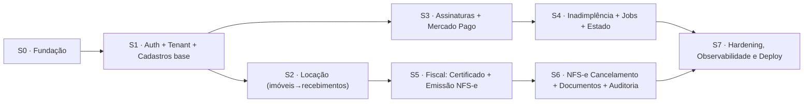

# 09 — Plano de Implementação (Sprints)

Divisão em **incrementos verticais** (sprints) que entregam valor testável a cada iteração. Cada sprint tem objetivo, entregáveis e *Definition of Done* (DoD). As sprints são iterações lógicas com escopo fechado; a equipe pode *time-boxá-las* conforme sua cadência — a ordenação abaixo respeita as dependências técnicas, não um calendário fixo.

## Visão geral

---

## Sprint 0 — Fundação técnica

**Objetivo:** esqueleto da solução pronto para receber features.

- Solução .NET 9 com projetos `Domain/Application/Infrastructure/Api/Worker` (doc 02) + `Directory.Packages.props`.
- Docker Compose (PostgreSQL 16 + Redis) e projeto Supabase (staging).
- `AppDbContext` inicial, *naming conventions* snake_case, primeira migration (`tenant`, `plano` + seed).
- Pipeline CI (build, testes, `dotnet format`, migrations bundle) no GitHub Actions.
- Serilog + HealthChecks + Swagger; `ProblemDetails` global.
- Testcontainers configurado nos testes de integração.

**DoD:** `docker compose up` sobe API/Worker; migration aplica no Supabase; CI verde; `/health` OK.

---

## Sprint 1 — Autenticação, Multi-tenant e Cadastros base

**Objetivo:** login real, isolamento por tenant e cadastros de Cliente/Usuário.

- Integração **Supabase Auth**: validação de JWT (JWKS), *access token hook* com `tenant_id/cliente_id/perfil` (doc 08).
- `ICurrentTenant`/`ICurrentUser`, `TenantMiddleware`, *global query filter* e **RLS** com `SET app.tenant_id` (doc 06).
- Entidades + migrations: `cliente` (PF/PJ), `usuario`; provisionamento de usuário via Admin API.
- CRUD de Clientes e Usuários (Commands/Queries, validators, políticas por perfil).
- Interceptors: `TenantSaveInterceptor`, `AuditableInterceptor`, `SoftDeleteInterceptor`.

**DoD:** dois tenants isolados comprovados por teste de integração (EF + RLS); login→CRUD com JWT; limites de usuário por plano aplicados.

---

## Sprint 2 — Locação: Imóveis, Inquilinos, Contratos e Recebimentos

**Objetivo:** núcleo operacional do produto e dashboard.

- Entidades + migrations: `imovel`, `inquilino`, `contrato`, `recebimento`.
- CRUD completo com **enforcement de `plano.max_imoveis`** (doc 06).
- Geração de `recebimento` por competência a partir do contrato (regra de vencimento).
- Marcar recebimento como pago; cálculo de atraso.
- Endpoints de dashboard (totais, alugados, recebido no mês, em aberto).

**DoD:** fluxo imóvel→contrato→recebimento ponta a ponta testado; bloqueio ao exceder limite do plano; dashboard consistente.

---

## Sprint 3 — Assinaturas e Mercado Pago

**Objetivo:** contratação e cobrança recorrente.

- Agregado `Assinatura` com máquina de estados (doc 01/05) + `pagamento_plano`.
- Trial automático de 7 dias na criação de conta.
- Adapter `IPagamentoGateway` (Mercado Pago Preapproval/Payments) com Polly.
- Fluxo de contratação: cria assinatura `PendentePagamento` → `init_point` → retorno.
- **Webhook** idempotente (`inbox_message`) + HMAC + `Outbox` (doc 08); ativação por evento de pagamento.
- Upgrade/Downgrade com validação de limites (bloqueio no downgrade que excede).

**DoD:** contratação em *sandbox* ativa a assinatura via webhook; upgrade/downgrade respeitam limites; auditoria registrada.

---

## Sprint 4 — Inadimplência, Jobs e Ciclo de Vida

**Objetivo:** automação do ciclo Trial→Tolerância→Suspensão→Reativação.

- `Aluguel.Worker` com **Quartz.NET** + processador de `Outbox`.
- Jobs: `TrialExpiradoJob`, `ToleranciaInadimplenciaJob` (7 dias), `GerarCobrancaRenovacaoJob`, `ReprocessarWebhookJob`.
- Falha de pagamento → `PendentePagamento` + e-mail/alerta; fim da tolerância → `Suspensa`.
- Reativação automática ao confirmar pagamento; cancelamento mantém acesso até fim do ciclo, depois `Suspensa` (dados preservados).
- `PlanoGuardMiddleware`: em `Suspensa`, libera só Login/Minha Conta/Pagamentos.
- `IEmailSender` (notificações de cobrança/falha).

**DoD:** simulação de inadimplência percorre todos os estados corretamente (testes de integração com relógio controlável via `IDateTimeProvider`).

---

## Sprint 5 — Fiscal: Certificado Digital e Emissão de NFS-e

**Objetivo:** emitir NFS-e com o certificado A1 do cliente.

- Buckets Supabase Storage + `IFileStorage` (doc 07); RLS de Storage.
- Upload/validação de certificado A1 (thumbprint, validade); senha cifrada via `ISecretProtector`.
- Adapter `INfseProvider` (ABRASF/provedor municipal): geração de RPS, assinatura XML, envio.
- Comando `EmitirNfse` (checa `PlanoComNfse` + `AssinaturaAtiva`) → `NotaFiscalServico` (`Processando`→`Autorizada`), via fila/worker.
- Persistência de XML/PDF em `documento_fiscal` + `content_hash`.

**DoD:** emissão em homologação retorna número/protocolo; XML/PDF no Storage com *signed URL*; senha do certificado nunca exposta.

---

## Sprint 6 — NFS-e: Cancelamento, Documentos e Auditoria

**Objetivo:** completar o ciclo fiscal e a trilha de auditoria.

- Cancelamento de NFS-e (`CancelarNfse`) com motivo e atualização de estado/arquivos.
- Consulta/listagem de notas, *download* de XML/PDF por *signed URL*.
- `OutboxInterceptor` publicando *domain events*; `audit_log` genérico (jsonb antes/depois).
- Trilha `auditoria_assinatura` completa para todos os eventos (doc 03).
- Reprocessamento de rejeições e reemissão.

**DoD:** emissão e cancelamento auditados; trilha consultável por cliente; documentos íntegros (hash conferido).

---

## Sprint 7 — Hardening, Observabilidade e Deploy

**Objetivo:** prontidão para produção.

- OpenTelemetry (traces/metrics) + dashboards; alertas de falha de webhook/job.
- Testes: cobertura de domínio, integração (Testcontainers), funcional (`WebApplicationFactory`), e de isolamento multi-tenant.
- Revisão de segurança (RLS *force*, segredos, LGPD, rate limiting, CORS) e testes de carga básicos.
- Migrations bundle no deploy; *blue/green* ou *rolling*; PITR/backup de Storage.
- Documentação operacional (runbooks) e *seed* de produção (planos).

**DoD:** ambiente de produção no subdomínio da Lucrare; NFS-e e Mercado Pago em produção; observabilidade ativa; testes verdes.

---

## Temas transversais (todas as sprints)

- **Segurança & LGPD**: TLS, segredos fora do repo, *soft delete*, auditoria.
- **Qualidade**: cada Command/Query com validator e testes; PRs pequenos; *analyzers* como erro.
- **Idempotência & resiliência**: Inbox/Outbox, Polly, *retries* com *backoff*.
- **Documentação viva**: manter os docs `01`–`08` sincronizados com o código.

## Matriz de rastreabilidade (spec → sprint)

| Requisito da especificação | Sprint |
|---|---|
| Multi-tenant, subdomínio | S1 |
| Cadastro de Clientes (PF/PJ) e Usuários | S1 |
| Planos e limites (imóveis/usuários) | S1–S2 |
| Imóveis, inquilinos, recebimentos, dashboard | S2 |
| Trial 7 dias | S3 |
| Contratação/renovação (Mercado Pago) + webhook | S3 |
| Falha de pagamento, tolerância, suspensão, reativação | S4 |
| Upgrade/Downgrade/Cancelamento | S3–S4 |
| Certificado digital + emissão de NFS-e | S5 |
| Cancelamento de NFS-e + documentos fiscais | S6 |
| Auditoria de assinaturas + auditoria geral | S1 (base) → S6 (completa) |
| Armazenamento criptografado (Storage) | S5 |
| Autenticação | S1 |

## Riscos e mitigações

| Risco | Mitigação |
|---|---|
| Variação de provedor NFS-e por município | `INfseProvider` com implementações plugáveis; começar por 1 município. |
| PgBouncer *transaction pooling* x `SET` de sessão | usar `SET LOCAL` em transação ou conexão *session mode* (doc 06). |
| Segurança da senha do certificado | cifra dedicada + acesso só no worker + auditoria (doc 07). |
| Divergência de webhooks Mercado Pago | Inbox idempotente + reconciliação por job (doc 03/04). |

---

Índice da arquitetura: [README](README.md).
