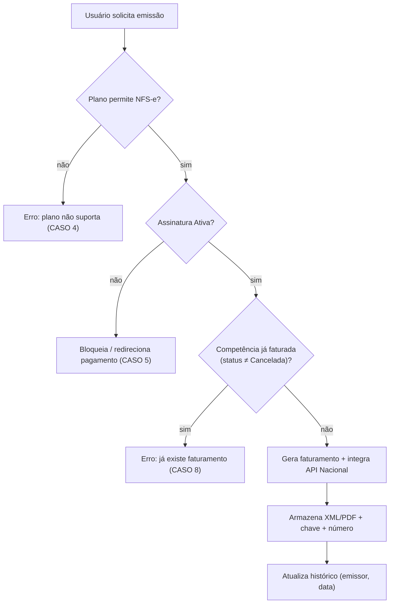

# 11 — Casos de Uso e Critérios de Aceite (BDD)

Consolida os **casos de uso (§17)** e os **critérios de aceite BDD (§18)** em formato executável, para orientar os testes funcionais (`Aluguel.Api.FunctionalTests`).

## 1. Casos de uso (§17)

| Código | Caso de uso | Ator | Pré-condição | Pós-condição |
|---|---|---|---|---|
| **UC001** | Cadastrar Cliente | AdminSistema / Gestor | Autenticado | Cliente PF/PJ criado com plano/status |
| **UC002** | Criar Usuário | Gestor / AdminSistema | Cliente existe; limite do plano | Usuário criado (Gestor/Analista) |
| **UC003** | Criar Imóvel | Gestor | Assinatura ativa; limite de imóveis | Imóvel ativo cadastrado |
| **UC004** | Criar Contrato | Gestor | Imóvel sem contrato ativo; inquilino | Contrato ativo vinculado |
| **UC005** | Emitir NFS-e | Gestor / Analista | Plano permite NFS-e; assinatura ativa; competência livre; certificado válido | NFS-e `Emitida` com XML/PDF/chave |
| **UC006** | Cancelar NFS-e | Analista / Gestor | NFS-e emitida | NFS-e `Cancelada` (protocolo + XML do evento) |
| **UC007** | Registrar Pagamento | Gestor / Analista | Competência sem pagamento | Pagamento registrado |
| **UC008** | Gerar Relatório | Gestor | Autenticado | Arquivo XLSX/CSV/PDF em `reports` |

### UC005 — Emitir NFS-e (fluxo principal)



## 2. Critérios de aceite (BDD — §18)

> Formato Gherkin (PT-BR). Cada cenário vira um teste funcional.

### CASO 1 — CPF de usuário único por cliente
```gherkin
Dado que já existe um usuário com um CPF em um determinado cliente
Quando eu tentar cadastrar um usuário com o mesmo CPF nesse cliente
Então o sistema deve apresentar erro informando que o CPF já está cadastrado nesse cliente
```

### CASO 2 — Downgrade com imóveis excedentes
```gherkin
Dado um cliente com plano que permite 10 imóveis e 10 imóveis cadastrados
Quando ele solicitar downgrade para um plano com limite menor
Então o sistema deve alertar que é preciso inativar imóveis para se enquadrar no novo plano
E o downgrade deve ser bloqueado até a adequação
```

### CASO 3 — Um contrato ativo por imóvel
```gherkin
Dado um contrato ativo de um inquilino para um imóvel
Quando o usuário tentar cadastrar novo inquilino para o mesmo imóvel
Então o sistema deve impedir e alertar que existe contrato válido
E orientar a inativar o contrato atual antes de cadastrar um novo
```

### CASO 4 — Plano sem emissão fiscal
```gherkin
Dado um cliente com plano Básico
Quando tentar emitir NFS-e
Então o sistema deve impedir e informar que o plano não suporta emissão fiscal
```

### CASO 5 — Assinatura suspensa
```gherkin
Dado que a assinatura está Suspensa
Quando o usuário acessar a Home
Então o sistema deve impedir o acesso e redirecionar para a tela de pagamento
```

### CASO 6 — Pagamento não duplicado
```gherkin
Dado que já existe pagamento registrado para uma competência
Quando tentar registrar novo pagamento para a mesma competência
Então o sistema deve impedir a operação
```

### CASO 7 — Reemissão após cancelamento
```gherkin
Dado que a NFS-e da competência foi cancelada
Quando o usuário emitir nova NFS-e para a mesma competência
Então o sistema deve permitir a emissão
```

### CASO 8 — Competência já faturada
```gherkin
Dado uma NFS-e Emitida, Em Processamento ou Rascunho para a competência 08/2026
Quando o usuário tentar emitir nova NFS-e para a mesma competência
Então o sistema deve impedir e apresentar mensagem de erro
```

## 3. Rastreabilidade (garantia técnica)

| Critério | Camada | Mecanismo |
|---|---|---|
| CASO 1 | Banco + App | `ux_usuario_cpf` + validação FluentValidation |
| CASO 2 | App | validação de limites no `DowngradeCommand` |
| CASO 3 | Banco + App | `ux_contrato_imovel_ativo` + validação |
| CASO 4 | App/Auth | policy `PlanoComNfse` (`plano.permite_nfse`) |
| CASO 5 | API | `AssinaturaSuspensaGuard` (HTTP 402) |
| CASO 6 | Banco + App | `ux_pagamento_competencia` |
| CASO 7 | App | filtro `status <> Cancelada` na validação |
| CASO 8 | Banco + App | `ux_nfse_competencia_ativa` + validação |

Índice: [README](README.md).
